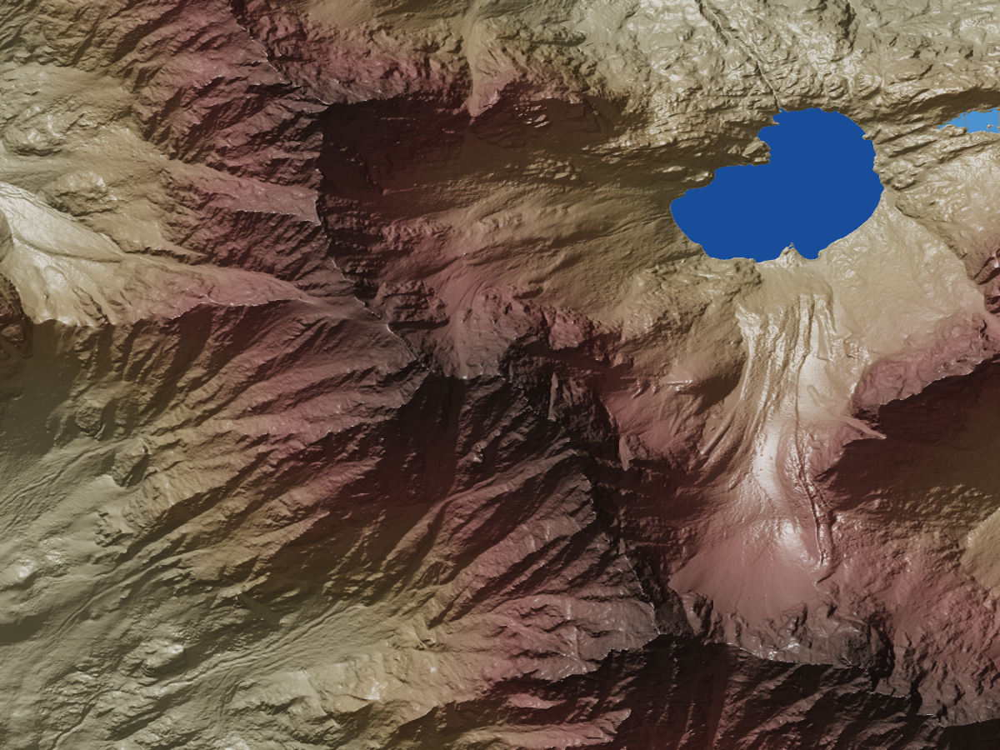

<div align="center">
  <a href="./">
    <picture>
      <source media="(prefers-color-scheme: dark)" srcset="assets/logo-2000-dark.png">
      
    </picture>
  </a>
</div>

# forge3d

Headless GPU rendering + PNG↔NumPy utilities (Rust + PyO3 + wgpu).

Current release: 0.94.0 — micro-detail upgrade with triplanar detail normals, distance-faded RNM blending, and procedural albedo noise for stable close-range variation.

## Installation

```bash
# from source
pip install -U maturin
maturin develop --release
# or via wheel (if provided)
# pip install forge3d
```

## Quick Start (< 10 minutes)

New to forge3d? Get a terrain rendering example working in a few seconds:

1. **Install prerequisites**: Ensure you have Python 3.8 installed
2. **Install maturin**: `pip install -U maturin`
3. **Build forge3d**: `maturin develop --release`
4. **Run terrain example**:

```bash
python examples/geopandas_demo.py 
--output-size 1200 900 
--lighting-type "blinn-phong" 
--lighting-intensity 1 
--lighting-azimuth 315 
--lighting-elevation 315 
--shadow-intensity 1 
--contrast-pct 0.5 
--gamma 0.5 
--camera-theta 90
```

This should be rendered within 5 seconds! 
The example will create a terrain image under `reports/Gore_Range_Albers_1m.png`.



## Platform requirements

Runs anywhere wgpu supports: Vulkan / Metal / DX12 / GL (and Browser WebGPU for diagnostics). A discrete or integrated GPU is recommended. Examples/tests that need a GPU will skip if no compatible adapter is found.
