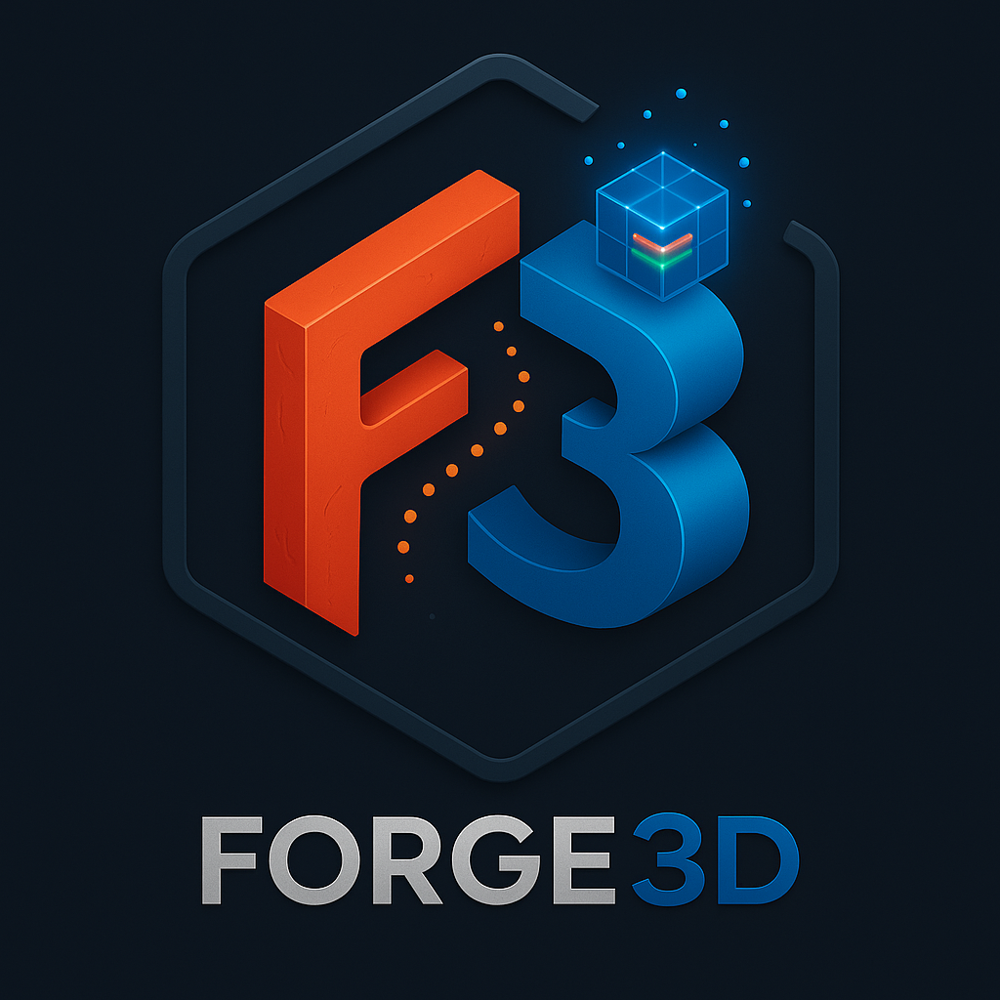

<div align="center">
  <a href="./">
    <picture>
      <source media="(prefers-color-scheme: dark)" srcset="assets/logo-2000-dark.png">
      
    </picture>
  </a>
</div>

# forge3d

Headless GPU rendering + PNG↔NumPy utilities (Rust + PyO3 + wgpu).

Current release: 1.10.1 — 3D Geospatial Platform featuring native OGC 3D Tiles support (B3DM/PNTS), Cloud-Optimized Point Cloud (COPC) streaming, and hierarchical LOD systems for massive dataset visualization.

## Latest Feature: 3D Geospatial Platform (Phase 5)

**forge3d** now powers massive geospatial visualization with a native **3D Tiles and Point Cloud engine**. The new Phase 5 platform introduces high-performance streaming and rendering for OGC 3D Tiles (including B3DM and PNTS payloads) and Cloud-Optimized Point Clouds (COPC/LAZ). The system features a hierarchical Screen-Space Error (SSE) traversal engine that automatically manages Level of Detail (LOD) to render city-scale datasets and billion-point clouds within a fixed memory budget.

*   **3D Tiles**: Full hierarchy traversal, geometric error-based refinement, and glTF integration for B3DM.
*   **Point Clouds**: Direct COPC/EPT support with out-of-core octree streaming and attribute styling.
*   **Performance**: Rust-native multithreaded decoding and WGPU-accelerated rendering.

```bash
# Preview a local 3D Tileset
python examples/tiles3d_demo.py --tileset assets/city/tileset.json --sse 16

# Stream a massive point cloud
python examples/pointcloud_viewer_interactive.py --copc https://s3.amazonaws.com/data/autzen.copc.laz
```

### Map Plate Compositor

Compare shadow quality across advanced techniques with dramatic lighting (sun elevation 10°):

| PCF | PCSS | VSM |
|-----|------|-----|
|  |  |  |
| Fixed-kernel soft shadows | Contact-hardening soft shadows | Variance-based probabilistic |

| EVSM | MSM |
|------|-----|
|  |  |
| Exponential variance (reduced leak) | 4-moment high precision |

**Note:** Low sun angles (10°) create long shadows where technique differences are most visible. PCSS produces contact-hardening with sharp edges near occluders and soft penumbra farther away. Moment-based techniques (VSM/EVSM/MSM) offer blur-friendly filtering with separable Gaussian blur support.

## Camera Animation Demo

Create smooth cinematic flyovers of your terrain with the new camera animation system:

```bash
python examples/camera_animation_demo.py --export ./frames --mp4 --sun-offset 150 --sun-intensity 1.5 --title "Mount Rainier"
```

This renders a dramatic orbit animation with backlighting and exports it directly to MP4 (requires ffmpeg).

https://github.com/user-attachments/assets/3ecbf842-7cf7-4f3b-806b-191087c23fb3

## Quick Start (< 10 minutes)

New to forge3d? Launch the interactive viewer and capture a high-resolution snapshot of Mount Fuji with place labels:

1. **Install prerequisites**: Ensure you have Python 3.8+ and Rust installed
2. **Install maturin**: `pip install -U maturin`
3. **Build forge3d**: `maturin develop --release`
4. **Build the interactive viewer**:

```bash
cargo build --release --bin interactive_viewer
```

5. **Launch the viewer with the Fuji labels demo**:

```bash
python examples/fuji_labels_demo.py --preset high_quality --width 3840 --height 2160
```

6. **Capture a 4K snapshot** (type this in the viewer's terminal):

```bash
snap fuji_labels.png 3840x2160
```


### Mount Rainier Demo

Alternatively, you can explore Mount Rainier with the classic interactive viewer.

**1. Launch the viewer with a high-quality preset:**

```bash
python examples/terrain_viewer_interactive.py --dem assets/tif/dem_rainier.tif --preset high_quality --width 800 --height 800
```

**2. Capture a high-resolution snapshot** (type this in the viewer's terminal):

```bash
snap highres_rainier.png 4000x4000
```

This workflow demonstrates forge3d's **supersampled snapshot** capability: the viewer runs at interactive resolution (800×800) for real-time exploration, then renders a single frame at 4000×4000 (16 megapixels) for publication-quality output. Because the GPU renders only one high-res frame on demand, you get print-ready imagery without the memory cost of a persistent 4K framebuffer.


## Terrain with Land Cover Overlays

The `swiss_terrain_landcover_viewer.py` example showcases the new **draped overlay system** by rendering a Switzerland DEM with land cover classification data (water, trees, crops, built areas, snow, etc.) overlaid on the terrain. The land cover overlay is automatically resampled to match the DEM resolution and receives full PBR lighting—including sun shading, shadows, and ambient occlusion—because it is blended into the terrain's albedo before lighting calculations. Four high-quality presets (`hq1`–`hq4`) enable everything from standard 4K renders to cinematic shots with depth of field and lens effects.

```bash
python examples/swiss_terrain_landcover_viewer.py --preset hq4 --snapshot swiss_render.png
```


## Platform requirements

Runs anywhere wgpu supports: Vulkan / Metal / DX12 / GL (and Browser WebGPU for diagnostics). A discrete or integrated GPU is recommended. Examples/tests that need a GPU will skip if no compatible adapter is found.
