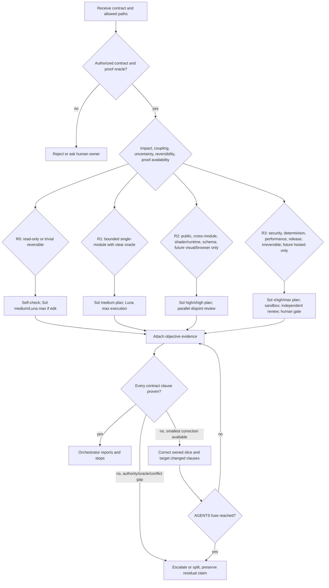
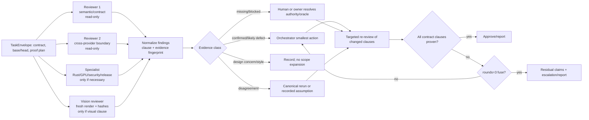

# Forge3D agent-routing and organizational model report

**Evidence date:** 2026-08-16.  
**Scope:** Forge3D development, debugging, refactoring, release, and visual QA.  
**Repository change status:** no repository files were modified. The `AGENTS.md` text below is proposed text, not an applied patch.

## Evidence discipline and contract

The recommendation is an evidence-first routing design, not a claim that benchmark rank predicts Forge3D performance.

- **Verified repository fact** means directly observed in the supplied repository packet and linked to an absolute file/line.
- **Benchmark evidence** means a reported DeepSWE or Arena snapshot. It is not a Forge3D result.
- **Official capability/cost** means provider documentation or pricing linked below.
- **Inference** means a design conclusion drawn from those facts.
- **Assumption** means an explicit unresolved premise used to make a smallest useful recommendation.
- **Unknown** means evidence is absent or entitlement/operation is not verified.

The governing contract is: select a maintainable multi-model organization and routing policy that improves correctness, cost efficiency, latency, context/tool use, review quality, failure containment, provider diversity, human oversight, reproducibility, and evidence quality for the actual Forge3D boundaries. The acceptance proof is the required taxonomy, model matrix, role architecture, risk routes, reviewer protocol, proposed `AGENTS.md` architecture, experiment, decision tree, Mermaid reviewer diagram, assumptions, evidence gaps, risk register, migration plan, and final stacks.

The repository's MSW kernel is authoritative: claims are work only when deleting them would leave the contract unmet or unproven; no unauthoritative quotas or limits may be invented; and `rounds = 3` is the explicit fuse in [AGENTS.md](D:/forge3d/AGENTS.md:1). The current role-routing authority is [AGENTS.md](D:/forge3d/AGENTS.md:47), classification/planning is [AGENTS.md](D:/forge3d/AGENTS.md:58), and the review contract is [AGENTS.md](D:/forge3d/AGENTS.md:95). Proposed routing below is an amendment to that current baseline, not an additive claim that the old policy remains active.

## 1. Executive recommendation

### Default organization

Use a **contract-led hub-and-spoke**:

1. A Sol-high orchestrator owns the contract, risk tier, evidence ledger, assignment, integration, and stop decision; it is an arbiter/coordinator, not an unreviewed implementer.
2. A stream-aligned owner works one bounded slice. A platform/evidence capability supplies canonical test, render, hash, provenance, and environment services.
3. Rust/GIS/WebGPU/WGSL/rendering are treated as complicated subsystems and receive boundary specialists when the contract touches them.
4. Reviewers start from the same immutable base/head and contract but use disjoint context and lenses. They are read-only and must attach reproducible evidence.
5. Human approval is mandatory for irreversible, security/provenance, release, public-contract, or unresolved high-uncertainty decisions.

This is an inference from the observed architecture and the organizational evidence: Team Topologies separates stream, platform, enabling, and complicated-subsystem work ([key concepts](https://teamtopologies.com/key-concepts), accessed 2026-08-16); Conway's Law makes communication boundaries visible in architecture ([original paper](https://www.melconway.com/Home/Committees_Paper.html), accessed 2026-08-16); NASA IV&V and NIST defense-in-depth support independent evidence and layered controls ([NASA IV&V](https://www.nasa.gov/ivv-overview/), [NIST SP 800-160v2](https://nvlpubs.nist.gov/nistpubs/SpecialPublications/NIST.SP.800-160v2.pdf), accessed 2026-08-16). The analogy is limited: models have no human motivation, tacit social memory, legal responsibility, or guaranteed independence.

### Organizational-theory fit

| Theory or structure | Useful transfer to Forge3D | Boundary of the analogy / decision |
|---|---|---|
| Team Topologies | Stream-aligned task owner, platform/evidence service, enabling diagnosis workflow, and complicated-subsystem Rust/GPU/GIS specialist map cleanly to observed boundaries. | Models do not form durable teams or own products; treat the categories as interfaces and evidence responsibilities. |
| Conway's Law and Reverse Conway | Align communication and `AGENTS.md` boundaries with the observed Rust/PyO3, shader, render, and release interfaces; reserve browser/worker boundaries for future introductions. | A model call does not change social architecture by itself; measure coordination friction before restructuring. |
| Brooks's Law | Additional agents add communication/context overhead; add a reviewer only for a necessary independent proof claim. | Human person-month curves do not translate to token costs or model quality; measure Forge3D latency/cost. |
| Gall's Law | Evolve from the smallest working envelope/proof loop, then add nested boundaries and specialists only when a measured gap appears. | Gall's statement is a systems heuristic, not a benchmark or a numeric rollout rule ([bibliographic record](https://books.google.com/books/about/General_Systemantics.html?id=6FgeAAAAMAAJ), accessed 2026-08-16). |
| OODA | Observe repository/evidence, orient to contract/tier, decide route, act in one slice, then observe new artifacts; this structures debugging and correction. | OODA is not a mandate to maximize speed or parallelism; evidence quality remains the stop condition ([archive](https://www.coljohnboyd.com/), [Army overview](https://www.army.mil/article/260435/ooda_loop), accessed 2026-08-16). |
| PDCA and double-loop learning | PDSA tests routing changes; double-loop review revisits the route/contract assumption when repeated evidence shows the loop itself is wrong. | Do not use “continuous improvement” to keep a completed claim alive; MSW still halts ([PDSA](https://deming.org/explore/pdsa/), [double-loop](https://hbr.org/1977/09/double-loop-learning-in-organizations), accessed 2026-08-16). |
| Information processing and bounded rationality | Add context, tools, or a specialist only where uncertainty/coupling exceeds one role's processing capacity; keep the orchestrator's ledger small. | Models have large context but still lose state, misread tools, and lack tacit project memory ([Galbraith DOI](https://doi.org/10.1287/inte.4.3.28), [Simon DOI](https://doi.org/10.2307/1884852), accessed 2026-08-16). |
| Division of labor and specialization | Stable execution, evidence-platform, boundary-specialist, and independent-review interfaces reduce repeated setup and preserve expertise. | Do not infer motivation or ownership from role labels; a role is only a permission/proof boundary ([Smith source](https://oll.libertyfund.org/titles/smith-the-wealth-of-nations-5-vols-in-1-vol-1), accessed 2026-08-16). |
| Centralized versus distributed decisions | Centralize contract/tier/merge authority; distribute bounded implementation and independent evidence across boundary owners. | A hub can become stale or a bottleneck; retain human escalation and immutable artifacts. |
| Hub-and-spoke, hierarchical, mesh, market-based | Hub-and-spoke is the default: one contract ledger, specialized spokes, and a platform evidence spoke. Hierarchy is reserved for authority gates; mesh/market selection is useful only for provider fallback experiments. | A fully distributed mesh multiplies context and reconciliation; a model marketplace does not prove diversity or availability. |
| Independent verification and separation of duties | Read-only reviewers from immutable snapshots, independent from executor narrative, provide IV&V-like containment. | Different model names do not guarantee independence; require evidence of disjoint context/lens/provider. |
| Fault containment and defense-in-depth | Owned paths, sandboxed execution, protected CI, deterministic artifacts, provenance, rollback, and human R3 gates contain failures in layers. | Controls reduce risk but do not prove absence of defects; each layer must produce evidence ([NASA IV&V](https://www.nasa.gov/ivv-overview/), [NIST SP 800-160v2](https://nvlpubs.nist.gov/nistpubs/SpecialPublications/NIST.SP.800-160v2.pdf), accessed 2026-08-16). |

### Operating modes

| Mode | Route | Model arrangement | Trade-off and guardrail |
|---|---|---|---|
| Low-cost | R0/R1 only | Sol medium planner when needed; Luna max executor; DeepSeek Flash max for non-sensitive static triage; one evidence lens only when the contract needs it | DeepSeek is the cost frontier but has China storage/training and slow harness latency; do not send sensitive data without an owner-approved policy. |
| Normal development | R1/R2 | Sol high orchestrator/reviewer; Sol medium normal planner; Luna max executor; Grok xhigh cross-provider reviewer; Gemini high only for visual evidence | Balanced quality, cost, and diversity. Use Terra high as a latency-oriented planner alternative. |
| Difficult/high-risk | R2/R3 | Sol xhigh or max difficult planner; Sol high orchestrator; Luna max sandboxed executor; Terra max or Kimi K3 max independent reviewer; Grok xhigh boundary reviewer; Gemini high for images; human gate | More context and independent lenses are justified by coupling, uncertainty, irreversible impact, or weak proof. Current policy escalates after two failed correction cycles; the root `rounds=3` fuse remains authoritative. |
| Visual/rendering | R2/R3 visual | Sol high planner; Luna max executor; Gemini high fresh multimodal render reviewer; Qwen xhigh only after endpoint entitlement is verified | Visual review must use fresh renders, deterministic seeds, image metrics, hashes, and provenance; image-to-WebDev leaderboard absence for Gemini/Grok/DeepSeek is unavailable-result evidence, not zero performance. |
| Provider-failure fallback | same tier, provider unavailable | Terra max or Kimi K3 max as planner/orchestrator alternative; Grok xhigh as independent reviewer; Qwen xhigh if entitled; DeepSeek Pro/Flash only for non-sensitive work | Record provider/model/prompt/tool metadata. A fallback is not equivalent until its required tools, retention, and proof gates are rechecked. |

### Final recommended role-to-model table

| Role | Default model/effort | Alternative | Permission and stop condition |
|---|---|---|---|
| Orchestrator | GPT-5.6 Sol high | Terra max; Kimi K3 max if privacy/availability are approved | Read/write task ledger and integration branch; no unreviewed high-risk merge; stop when every contract clause is proven or escalated. |
| Normal planner | GPT-5.6 Sol medium for R0/R1 | Terra high for latency; DeepSeek V4 Pro only as a proposed non-sensitive planning alternative after owner approval | Read repository and contract; emit dependency/proof plan; stop when the slice and oracle are explicit. |
| Difficult planner | GPT-5.6 Sol xhigh; Sol max only quality-first R3 | Terra max; Kimi K3 max | Read-only planning until contract, boundaries, failure modes, and proof plan are explicit; stop before execution. |
| Executioner | GPT-5.6 Luna max | Terra high for fast contained work; DeepSeek Flash max for approved static work | Modify only owned paths; run declared checks; stop on scope, authority, or proof failure. |
| Reviewer 1 | GPT-5.6 Sol high | Terra max | Independent contract/semantic lens, read-only; approve only proven clauses. |
| Reviewer 2 | Grok 4.6 xhigh | Kimi K3 max; Qwen xhigh if entitled | Cross-provider boundary/tooling lens, read-only; report evidence, not rewrites. |
| Reviewer 3 / specialist | DeepSeek V4 Pro max for non-sensitive static analysis | Terra max or a boundary specialist | Cheap diversity lens only where data policy allows; never sole R3 arbiter. |
| Vision/render reviewer | Gemini 3.7 Flash high | Qwen xhigh after entitlement verification; human visual inspection | Fresh render/image-diff/provenance lens; no textual approval without artifacts. |
| Human escalation | Repository owner/release/security owner | — | Resolves authority, privacy, irreversible changes, public claims, conflicting evidence, and residual R3 risk. |

**Current-policy replacement (verified 2026-08-16):** the root routing baseline is reviewer GPT-5.6 Sol high, planner `opencode-go/qwen3.8-max`, task execution `opencode-go/deepseek-v4-flash`, default GPT-5.6 Luna max, and vision `opencode-go/deepseek-v4-pro` ([AGENTS.md](D:/forge3d/AGENTS.md:47)). The table above is a proposed evidence-driven amendment; it does not describe the active route. Current policy uses normal planning for R0–R1 and difficult planning for R2–R3 ([AGENTS.md](D:/forge3d/AGENTS.md:58)).

Current review workflow is also authoritative: reviewers are read-only, use the same immutable snapshot, run independently in parallel, and submit findings with **severity `BLOCKER`, `MAJOR`, `MINOR`, or `NIT`** and **status `PASS`, `FAIL`, or `UNVERIFIED`** ([AGENTS.md](D:/forge3d/AGENTS.md:95)). Those finding severities/statuses are distinct from task tiers R0–R3; a R2 task can contain a MINOR finding, and a R0 task can contain a BLOCKER. After a correction, only affected reviewers rerun; architecture disagreement or **two failed correction cycles** escalates to the difficult planner ([AGENTS.md](D:/forge3d/AGENTS.md:112)). The map-work exception is explicit: when creating a map, ignore the mandatory workflow and use the default model ([AGENTS.md](D:/forge3d/AGENTS.md:132)).

## 2. Forge3D task taxonomy

The repository is not a single-language service. Verified boundaries include two public paths and runtime/package/IPC/OSS-Pro distinctions in [docs/start/architecture.md](D:/forge3d/docs/start/architecture.md:1), a package/workflow map in [docs/guides/feature_map.md](D:/forge3d/docs/guides/feature_map.md:1), Rust/PyO3 surfaces in [src/lib.rs](D:/forge3d/src/lib.rs:59), Python exports in [python/forge3d/__init__.py](D:/forge3d/python/forge3d/__init__.py:1), package features in [Cargo.toml](D:/forge3d/Cargo.toml:1) and [pyproject.toml](D:/forge3d/pyproject.toml:1), and build/provenance logic in [build.rs](D:/forge3d/build.rs:50). A measured `rg --files` scan reported 1,137 Rust files under `src`, 89 package Python files, 302 `tests/test_*.py` files, and 114 documentation files; those counts are snapshot facts, not routing limits.

**Topology correction (verified current tracked snapshot):** the scan found zero `package.json` files and zero JavaScript/TypeScript files. It found no named `@forge3d/web`, Forge3D Studio, browser/WASM product-build, worker, or deployment path. The only current WASM evidence is one conditional in [effects.rs](D:/forge3d/src/scene/private_impl/effects.rs:30). Hosted delivery is documented as a non-goal in [competitive_positioning.md](D:/forge3d/docs/guides/competitive_positioning.md:10). Therefore browser/WASM product builds, Studio, worker/hosted rendering, and hosted deployment are not current validation gates; they remain only synthetic/future R2/R3 introductions if a future contract creates those paths.

Reviewer cells below intentionally say **MSW-minimal** rather than imposing a universal reviewer count. Instantiate a disjoint reviewer lens only when the contract needs an independent proof claim. Plan mode currently requires three blind reviewers by [AGENTS.md](D:/forge3d/AGENTS.md:117); that is a current workflow requirement, not a universal reviewer count. Finding severity remains BLOCKER/MAJOR/MINOR/NIT and review status remains PASS/FAIL/UNVERIFIED; task tier R0–R3 is separate. The root `rounds = 3` fuse is distinct from the current escalation after two failed correction cycles.

| Task class | Risk / layers | Tools and context | Visual inspection | Planning depth | Reviewer requirement | Validation gates | Recommended route |
|---|---|---|---|---|---|---|---|
| Documentation/examples | R0 unless claims/API change; docs, examples | `rg`, Sphinx/docs build, linked API context | No, unless example is visual | Normal or none | MSW-minimal; objective docs build | Docs build, link/code-example checks, attribution | Sol medium → Luna max only if edits; R0 |
| Contained bug fix | R1; one module, clear oracle | Local code/tests, narrow diff | Only if rendering/output changes | Normal | One independent lens only if behavior changes | Targeted unit/integration tests, formatter/lint | Sol medium → Luna max → Sol high as needed; R1 |
| Python/API change | R2; Python, PyO3, public exports, schemas | Python package + bindings + API docs | If output/plot contract changes | Normal; difficult if public compatibility uncertain | Contract/API lens plus boundary lens when both change | Canonical [ci_pytest_lane.py](D:/forge3d/scripts/ci_pytest_lane.py:1), binding checks, targeted/workspace/all-features Rust checks | Sol high/xhigh → Luna max → Sol high + specialist; R2 |
| Rust/GIS | R2/R3; Rust core, raster/vector, native ABI | Cargo aliases, feature matrix, GIS fixtures, provenance | If terrain/scene output changes | Difficult when cross-crate or ABI | Rust/GIS specialist plus independent contract lens as necessary | `cargo check/test/clippy`, targeted/workspace/all-features, Python binding lane | Sol xhigh/max → Luna max → Terra/Grok specialist; R2/R3 |
| WebGPU/WGSL/shader | R3 when GPU or determinism is affected; shader ABI, Naga, renderer | WGSL validator, GPU probes, shader contracts, physical adapter identity | Yes | Difficult | Shader specialist and fresh-render lens | Probe, golden certificate TOMLs and policy in [tests/golden/certificates/README.md](D:/forge3d/tests/golden/certificates/README.md:1), zero-skip assertion in [scripts/assert_junit_zero_skips.py](D:/forge3d/scripts/assert_junit_zero_skips.py:1) | Sol max/xhigh → Luna max → Grok/Terra + Gemini; R3 |
| WASM/browser (not found; synthetic/future) | Future R3 only if a product/build path is introduced; one current wasm conditional is not a product boundary | No current JS/TS/package/browser build path; future browser/WASM fixtures would be synthetic | Only for a future contract | Difficult if introduced | Future browser/runtime lens plus visual lens | No current WASM/browser gate; future contract must define build, browser, runtime, and artifact evidence | Do not route current tasks; future introduction → R3 difficult plan and human owner |
| Forge3D Studio/UI (not found; synthetic/future) | Future R2/R3 only if a Studio/UI path is introduced | No current Studio, `@forge3d/web`, package.json, JS, or TS path; future UI fixture only | Only for a future contract | Normal for a contained future UI change; difficult if cross-boundary | Future UI/interaction and visual lenses | No current Studio/UI gate; future contract must define build, browser, accessibility, and screenshot evidence | Do not route current tasks; future introduction → R2/R3 by coupling |
| Worker/hosted rendering (not found; synthetic/future) | Future R3 only; hosted delivery is a documented non-goal | No current worker/deployment path; hosted execution is hypothetical | Only for a future contract | Difficult if introduced | Future worker/security/platform lens and human owner | No current hosted/worker gate; future contract must define local/hosted identity, rollback, and provenance | Do not route current tasks; future introduction → R3 difficult plan and human gate |
| Schema/contract | R2/R3; RenderSpec, manifests, public interchange | Schema fixtures, compatibility matrix, generated artifacts | If schema controls images | Difficult if migration/compatibility | Contract lens and consumer lens | Schema validation, backward/forward fixtures, manifest/hash checks | Sol xhigh → Luna max → Sol high + specialist; R2/R3 |
| Performance | R2/R3; hot path, GPU/CPU, memory, latency | Bench harness, profiler, fixed environment, baseline | If frame/render quality trade-off | Difficult | Performance lens plus correctness lens | Reproducible baseline, benchmark artifacts, no quality regression, environment metadata | Sol xhigh → Luna max → Terra/Grok; R2/R3 |
| Refactoring | R2; many modules or boundaries | Dependency graph, API inventory, tests, compile matrix | If renderer touched | Normal or difficult by coupling | Boundary/compatibility lens; no style-only findings | Full declared test/build gates, public API diff, deterministic artifacts if relevant | Sol high/xhigh → Luna max → Sol/Grok; R2 |
| Release/packaging | R3; wheels, versions, CI, publish/funnel | Maturin/Cargo, release manifests, CI, signing/provenance | If visual artifacts ship | Difficult | Release/security lens plus human gate | Wheel lanes in [ci.yml](D:/forge3d/.github/workflows/ci.yml:256), Rust/Python/ABI lanes, publish/funnel, rollback evidence | Sol max → Luna max → Terra/Grok + human; R3 |
| Visual/render quality | R2/R3; renderer, terrain, image artifacts | Fixed seed, GPU identity, renderer, screenshot/image diff, hashes | Required | Difficult when output contract changes | Fresh Gemini visual lens plus renderer specialist | Golden certificates, probes, deterministic seed matrix, hashes/manifests, perceptual and exact comparisons | Sol xhigh/max → Luna max → Gemini + specialist; R2/R3 |
| Security/provenance | R3; secrets, data retention, attribution, manifests | Threat model, dependency/security tools, provenance files, access logs | Only if artifact claim is visual | Difficult | Independent security/provenance lens and human owner | Protected CI, no-secret evidence, manifests, attribution, retention decision, rollback | Sol max → Luna max sandbox → Grok/Terra + human; R3 |

## 3. Model capability and cost matrix

DeepSWE is a benchmark snapshot, not a Forge3D oracle. Its live JSON was generated 2026-08-13 with 113 tasks and four runs per row; verifier/provider/network failures were excluded, while context and timeout failures counted as failures. Costs are harness estimates, not list API prices ([site](https://deepswe.datacurve.ai/), [live JSON](https://deepswe.datacurve.ai/artifacts/v1.1/leaderboard-live.json), accessed 2026-08-16). Arena is human-vote ELO, not a long-horizon repository test ([Code](https://arena.ai/leaderboard/code), [Data Analytics](https://arena.ai/leaderboard/code/data-and-analytics-applications), [Image-to-WebDev](https://arena.ai/leaderboard/code/image-to-webdev), accessed 2026-08-16).

OpenAI's official guidance labels Sol frontier, Terra balanced, and Luna high-volume; effort levels are none/low/medium/high/xhigh/max, with max reserved for hardest quality-first work ([latest-model guidance](https://developers.openai.com/api/docs/guides/latest-model), accessed 2026-08-16). The official comparison lists text+image input, tools/structured output, 1.05M context/128k output, and current API list prices Sol $5/$30 (cached $0.50), Terra $2/$12 (cached $0.20), and Luna $0.20/$1.20 (cached $0.02) per million input/output tokens; tier rates vary ([model comparison](https://developers.openai.com/api/docs/models/compare), accessed 2026-08-16). These are API list prices, not the DeepSWE harness estimates shown in the matrix; subscription economics are unknown and were not evaluated. Provider benchmark claims are not independent validation ([release](https://openai.com/index/gpt-5-6/), accessed 2026-08-16).

Privacy and availability are routing inputs, not footnotes. OpenAI API content is not used for training unless opted in; default abuse logs can be retained up to 30 days, approved ZDR/MAM removes content, and some Responses stateful endpoints store state for 30 days. Gemini paid data is not used for product training, but Interactions/File/caching and Search/Maps grounding have separate retention behavior. xAI documents no training without permission and default encrypted 30-day abuse retention; ZDR removes disk storage but disables some stateful endpoints. Kimi permits prompt/file/output use to optimize or train and has no public ZDR; DeepSeek collects inputs/files/history for improvement with PRC storage and disk KV cache; Qwen retention/ZDR is version- and endpoint-dependent. Verify the current endpoint and data class before every fallback.

| Candidate / effort | Benchmark and official evidence | Strengths for Forge3D | Weaknesses / likely failure | Best and poor fit | Role suitability and quality/cost position |
|---|---|---|---|---|---|
| GPT-5.6 Sol medium | DeepSWE pass@1 .6106, mean harness $1.862, 423s, median peak context 65,185 | Cheapest Sol setting; fast context inspection; tools/structured output | Lower pass@1 than Sol high; insufficient for coupled GPU/ABI reasoning | Best R0/R1 planning, docs, triage; poor R3 arbiter | Normal planner for low risk; not final high-risk reviewer. |
| GPT-5.6 Sol high | pass@1 .6940, $3.470, 594s, 98,355 | Strong correctness/cost balance; long context and tools | More cost/latency than medium; still not proof without artifacts | R1/R2 plans, contract review, orchestration | Default orchestrator/reviewer; Pareto frontier in this snapshot. |
| GPT-5.6 Sol xhigh | pass@1 .7073, $4.704, 800s, 133,054 | Better long-horizon reasoning; useful architecture preservation | Higher latency/cost; benchmark-only gain | Difficult planner, cross-boundary refactor, performance | R2/R3 difficult planner; frontier, not default everywhere. |
| GPT-5.6 Sol max | pass@1 .7267, $8.386, 1,129s, 177,471 | Highest DeepSWE pass@1 in supplied snapshot; quality-first reasoning | Highest Sol cost/latency; context hunger; still needs independent evidence | R3 planner/arbiter, release/security | Quality frontier; reserve for high uncertainty or irreversible work. |
| GPT-5.6 Terra high | pass@1 .5376, $1.134, 364s, 68,750 | Fast and inexpensive official “balance” model | DeepSWE quality substantially below Sol high; weak for long horizon | Latency-sensitive R0/R1 planning/execution | Budget planner alternative; not sole R2/R3 arbiter. |
| GPT-5.6 Terra xhigh | pass@1 .6018, $2.127, 584s, 108,741 | More reasoning than high at moderate cost | Below Sol medium in DeepSWE; not a quality frontier point | Fallback or independent narrow review | Useful provider/effort fallback, not default planner. |
| GPT-5.6 Terra max | pass@1 .6962, $4.946, 1,017s, 177,398 | Near Sol high quality; provider-diverse fallback | Slower and costlier than Sol high in snapshot | R2/R3 fallback, second opinion | Strong alternative reviewer/orchestrator when Sol unavailable. |
| GPT-5.6 Luna max | pass@1 .6719, pass@4 .9027, $3.028, 1,123s, 201,647 | Low official price; best supplied pass@4; high-volume role | Slow harness duration and largest median context; not a final arbiter | Owned-slice execution, repetitive fixes; poor authority synthesis | Default executor; excellent cost frontier for repeated attempts, context hungry. |
| Kimi K3 max | DeepSWE pass@1 .6851, pass@4 .8938, $4.655, 4,541s, 130,945; Arena Code rank 2 | 1.048M context, native vision, tools/JSON/structured output, always thinking; official $3 input/$15 output per M, $0.30 cache-hit | Very slow benchmark duration; account-specific limits; privacy policy permits optimization/training and no public ZDR | Difficult planning or cross-provider review; poor latency-sensitive loops | High-quality diversity alternative; never assume privacy equivalence. |
| Gemini 3.7 Flash high | DeepSWE pass@1 .6527, $2.176, 1,245s, 221,181; Arena Code rank 8 | Official multimodal text/image/video/audio/PDF, tools and thinking; strong visual debugging; official promo $0.75/$3.75 per M through 2026-12-31 | Large context/latency; Image-to-WebDev row unavailable, so no visual leaderboard claim | Fresh render review; Studio/browser use is future-only and not a current Forge3D path; poor sole Rust authority | Proposed visual specialist; use medium ($2.025 harness) when quality permits. |
| Qwen3.8 Max xhigh | DeepSWE pass@1 .5746, $3.729, 2,567s, 160,572; Arena Code rank 3, Data Analytics rank 2, and Image-to-WebDev rank 2 (**Arena effort unspecified**) | Strong Arena code/image-to-web evidence; 1M context and vision listed by marketplace; marketplace lists $2/$6 per M | API example says `qwen3.8-max`, chooser says `qwen3.8-max-preview` Token-Plan-only; entitlement unknown; retention/ZDR page version varies | Image/UI review and fallback if endpoint verified; poor default until availability proven | Candidate diversity/vision specialist only after runtime check; xhigh route is an inference from DeepSWE, not Arena. |
| Grok 4.6 xhigh | DeepSWE pass@1 .6674, $5.498, 1,272s, 156,581; **Arena Code Grok 4.6 high rank 5** | Cross-provider reasoning, text+image, tools/structured output, 500k context; official $2/$6 per M under 200k and $4/$12 at or above 200k | Higher price than Luna/Sol high; no Image-to-WebDev result; exact limits tiered | Independent boundary/security/tool review; poor visual specialist | Recommended reviewer 2; xhigh route is an inference from DeepSWE, not the Arena effort label. |
| DeepSeek V4 Pro max | DeepSWE pass@1 .6283, $0.241, 2,212s, 232,375; Arena Code rank 10 | Extreme harness/API cost frontier; 1M context/384k output; concurrency Pro 500; official peak $0.044/$1.32/$3.96 and off-peak $0.022/$0.66/$1.98 per M (cache/miss/output) | Slow; prompts/files/history used for improvement, PRC storage, no public ZDR; disk KV cache hours-days | Non-sensitive static triage/review; poor privacy-sensitive or time-critical R3 | Optional cheap reviewer 3 only with explicit data approval. |
| DeepSeek V4 Flash max | DeepSWE pass@1 .5332, $0.100, 1,439s, 201,637; **Arena Code DeepSeek V4 Flash high rank 11** | Lowest supplied cost; concurrency Flash 2,500; official peak $0.014/$0.44/$1.32 and off-peak $0.007/$0.22/$0.66 per M (cache/miss/output) | Low quality and slow for the price; same retention/training/storage risk | R0 lint/triage, non-sensitive duplicate finding; poor final review/execution | Budget-only lens, never sole approval. |

Provider facts for Kimi, Qwen, Gemini, DeepSeek, and Grok are documented in the source register below. Exact rate limits are dynamic/account-specific for several providers; they are therefore evidence gaps, not invented routing quotas.

No additional currently available model is added: the supplied packets contain no Forge3D-specific evidence that would justify another candidate over these routes.

### Pareto interpretation

- In the supplied DeepSWE pass@1/mean-cost snapshot, a strict cost-quality frontier is DeepSeek Flash max → DeepSeek Pro max → Gemini Flash medium → Luna max → Grok 4.6 medium → Sol high → Sol xhigh → Sol max. Terra max, Kimi, Grok xhigh, Gemini high, Qwen, and lower Terra/Luna settings are dominated in that two-dimensional snapshot; confidence intervals and Forge3D transfer are not established.
- For DeepSWE pass@4, the strict frontier reported is DeepSeek Flash max (.8053, $0.100), DeepSeek Pro max (.8850, $0.241), and Luna max (.9027, $3.028). This supports repeated cheap execution plus independent proof, not “Flash is best.”
- Arena's human-vote snapshot favors Kimi/Qwen/Grok/Sol for code and Qwen/Sol/Kimi for image-to-WebDev, but model availability differs by board and the vote task is not Forge3D. The result is a diversity signal, not a routing verdict.
- Official multimodality makes Gemini a practical visual reviewer; it does not establish pixel-level Forge3D correctness. Fresh Forge3D renders, hashes, manifests, and human escalation remain required.
- The starting hypothesis named **DeepSeek V4 Flash high** as reviewer 3. The supplied DeepSWE evidence is Flash **max** (.5332 pass@1, $0.100 harness mean) and Arena labels Flash **high** rank 11 without a comparable Forge3D task; therefore Flash-high reviewer quality is unknown. Keeping Flash as a non-sensitive triage/diversity lens is an inference, not verified superiority, and it cannot be the sole approval lens.

## 4. Recommended role architecture

The roles are interfaces, not claims of human agency. Each role receives a contract and evidence packet, produces a structured artifact, and stops when its local proof obligation is closed or blocked.

| Role | Responsibilities | Inputs | Outputs | Permissions | Stop condition |
|---|---|---|---|---|---|
| Orchestrator | Translate request into contract clauses; classify tier; maintain claim/evidence ledger; assign disjoint slices; synthesize findings; decide split/escalate/report | TaskEnvelope, repository snapshot, policy, model/tool metadata | Assignment packets, route decision, synthesis, residual claims, final report | Ledger/integration authority; may not waive required proof or silently broaden scope | Every clause proven, or `rounds=3` fuse reached with residuals reported, or human decision required |
| Normal planner | Map dependencies, touched boundaries, smallest slice, oracle, commands, artifacts, and rollback | Contract, immutable tree, relevant instructions | Plan with paths, risks, validation commands, evidence schema | Read-only repository access | Plan states a bounded slice and reproducible proof; otherwise returns blocked/needs-human |
| Difficult planner | Model coupled Rust/GIS/GPU/rendering dependencies, plus future WASM/worker/release introductions; challenge assumptions; design staged proof and rollback | Contract, architecture map, prior incidents, environment constraints | Risk register, dependency closure, proof matrix, split/escalation decision | Read-only; no implementation | No unresolved authority or missing oracle remains unacknowledged |
| Executioner | Implement only owned paths; preserve interfaces; run declared checks; attach exact artifacts and provenance | Approved plan, owned-path list, base/head, toolchain | Diff, test logs, render artifacts, hashes, manifest, failure packet | Write only owned paths; no policy/contract edits without re-plan | Checks pass and artifacts attach, or first unprovable/unsafe condition is reported |
| Reviewer 1 | Independent contract/semantic verification; reproduce defects and required checks | Immutable base/head, contract, execution diff, proof plan | ReviewEnvelope with findings and decision | Read-only; may run checks in isolated workspace | All assigned clauses proven or classified with evidence |
| Reviewer 2 | Cross-provider boundary/tooling/operational lens; look for integration and failure containment gaps | Same immutable snapshot, no reviewer narrative, specialized checklist | Independent ReviewEnvelope | Read-only; no code rewrite | Same as Reviewer 1; disagreement is preserved, not voted away |
| Reviewer 3 / specialist | Narrow Rust/GIS, shader, security, release, or data-policy verification where necessity is demonstrated | Boundary-specific packet and canonical fixtures | Specialist findings, blocked checks, evidence links | Read-only; scope limited to declared boundary | Boundary claims proven or escalated |
| Vision/render reviewer | Re-render from fixed seed/environment; compare pixels/perceptual metrics; inspect labels/composition/provenance | RenderSpec, seed, adapter identity, expected artifact, new render | Image evidence, diff metrics, visual findings, hashes | Read-only; may request rerender, not alter source | Visual clauses proven or image/equipment gap recorded |
| Human escalation point | Resolve authority, irreversible/security/privacy/release choices, disputed interpretation, and residual R3 risk | All envelopes, evidence, assumptions, policy | Decision record with owner and rationale | Sole authority for explicitly reserved decisions | Decision recorded; otherwise task remains blocked |

The orchestrator coordinates rather than becoming a single point of truth. This follows information-processing theory (add processing capacity only where uncertainty requires it; [Galbraith DOI](https://doi.org/10.1287/inte.4.3.28), accessed 2026-08-16) and bounded rationality ([Simon DOI](https://doi.org/10.2307/1884852), accessed 2026-08-16). Brooks's coordination warning ([publisher](https://www.pearson.com/en-us/subject-catalog/p/mythical-man-month-the-essays-on-software-engineering-anniversary-edition/P200000000149/9780201835953), [DOI](https://doi.org/10.1109/MC.1987.1663532), accessed 2026-08-16) argues against adding agents without a proof gap; it does not provide a universal model/person-hour law.

## 5. Routing policy

### Tier calculation

Select the maximum justified tier across **impact, coupling, uncertainty, reversibility, and proof availability**. These are decision dimensions, not weighted scores. Escalate when coupling crosses a boundary, uncertainty has no oracle, evidence conflicts, the contract changes, or a protected/irreversible operation is requested. Split when one owner cannot state a coherent slice and proof. Reject when no authorized contract/proof exists or required authority is missing.

### Routes

| Route | Scope | Models invoked | Planning | Reviewer execution | Required evidence | Correction/review rule and escalation |
|---|---|---|---|---|---|---|
| R0 | Read-only docs, formatting, trivial contained edits with a clear oracle | Sol medium or no planner; Luna max only for edits | Normal/none | No fixed reviewer; objective self-check | Diff, formatter/linter, docs/example build, links | Do not add a reviewer unless a contract clause needs independent proof. |
| R1 | Bounded reversible single-module bug/feature with clear oracle | Sol medium planner; Luna max executor; Sol high or Terra high lens only when behavior/API evidence needs independence | Normal | Sequential only if the first finding changes the proof plan; otherwise one independent read-only lens | Targeted tests, package/binding checks, exact command output | Stop at first scope/authority/proof failure; split rather than add coordination. |
| R2 | Public API, cross-module, schema, shader/runtime, or material uncertainty; browser/visual only if a future path is introduced | Sol high planner; Sol xhigh when coupling is material; Luna max executor; Grok xhigh and boundary specialist as needed | Difficult (current policy; proposal may choose Sol high/xhigh) | Parallel from immutable snapshot with disjoint lenses; targeted re-review of changed clauses | Boundary checks, API/schema compatibility, Rust/Python gates, deterministic artifacts where relevant; no current browser/WASM product gate | Use only the lenses needed by the contract. Escalate conflicts or missing oracle; no vote-based approval. |
| R3 | Security, data loss, irreversible/release/public claim, determinism, performance-critical, or future worker/hosted/WASM/browser introduction | Sol xhigh/max difficult planner; Sol high orchestrator; Luna max sandbox; Terra max/Kimi/Grok specialists; Gemini visual; human | Difficult (current policy) | Parallel independent reviewers and human gate; plan mode's current three blind reviewers remain authoritative where invoked | Protected CI, physical adapter/ABI identity, reproducible seeds, image/hash/manifest/provenance, security/privacy/rollback evidence; hosted/worker gates are future-only because delivery is a documented non-goal | Current policy escalates after two failed correction cycles; the global `rounds=3` fuse remains [AGENTS.md](D:/forge3d/AGENTS.md:1). After escalation/fuse, report residual claims; do not invent another retry cap. |

### Validation mapping

- Rust/PyO3 work must use the repository's Cargo aliases and targeted, workspace, and all-features checks as appropriate; Python/GIS work uses the canonical honesty lane in [scripts/ci_pytest_lane.py](D:/forge3d/scripts/ci_pytest_lane.py:1).
- GPU/render work requires a probe, shader/golden certificate evidence in [tests/golden/certificates/README.md](D:/forge3d/tests/golden/certificates/README.md:1), and zero-skip enforcement in [scripts/assert_junit_zero_skips.py](D:/forge3d/scripts/assert_junit_zero_skips.py:1). The protected CI lanes require physical NVIDIA identity for F3DZ; the ANAMNESIS lane consumes Vulkan seed/DX12 evidence. These are repository packet facts, not model claims.
- Release work must prove Rust, wheel, Python, ABI, publish/funnel, and rollback gates in [ci.yml](D:/forge3d/.github/workflows/ci.yml:143).
- The determinism matrix is currently informational/experimental; it cannot be presented as equivalent to aggregate `ci-success`. Treat this as an evidence gap until policy changes.

### Routing decision tree



## 6. Reviewer interaction design

### Protocol

1. The orchestrator emits a `TaskEnvelope` containing `protocol_version`, `task_id`, contract clauses, allowed paths, tier reason, immutable base/head, proof plan, commands/artifacts, model/prompt/tool metadata, data-retention policy, and human owner.
2. Every reviewer checks out the same immutable base/head and receives the contract/proof plan, not the executor's narrative or another reviewer's verdict. Review is read-only; checks run in isolated workspaces.
3. Reviewers use specialized lenses: contract/semantic, cross-provider boundary/tooling, Rust/GIS or shader/runtime/security/release, and fresh render/vision only when required. Parallel execution reduces waiting; sequential review is reserved for a changed proof plan or dependency closure.
4. Each reviewer emits a `ReviewEnvelope` with `protocol_version`, `task_id`, `tier`, `round`, `source`, contract clauses and proof types, independence statement, checks/commands/artifacts, findings, decision, assumptions, residual claims, and stop reason.
5. A finding contains `id`, `severity` (`BLOCKER`, `MAJOR`, `MINOR`, or `NIT`), claim, contract clause, necessity result (`passes`, `fails`, or `unknown`), exact reproduction/observation/artifact, task-tier impact (R0–R3), confidence (`high` = reproduced by an objective check, `medium` = partial reproducible evidence, `low` = reasoned concern), smallest action, and owner. The review status is `PASS`, `FAIL`, or `UNVERIFIED`; task tier and finding severity are separate dimensions. `unknown` confidence is used for a blocked check; these labels describe evidence quality, not model certainty.
6. Classify findings as **confirmed defect**, **likely defect**, **design concern**, **style preference**, **missing evidence**, **blocked check**, or **disagreement**. Only the first, second, missing-evidence, and blocked-check classes can keep a contract clause open; style preference alone cannot.
7. Deduplicate on `(contract clause, normalized failure, evidence fingerprint)` while preserving every reviewer verdict and context. Do not majority-vote away a reproducible failure.
8. Resolve disagreement by rerunning the canonical environment when evidence conflicts; ask the human owner or record the smallest assumption when interpretation conflicts; escalate when risk/authority conflicts. Common-mode agreement without proof is not approval.
9. After a fix, re-review only changed clauses and their dependency closure. Reopen the wider review only when an interface, fixture, renderer, schema, or evidence contract changed.
10. Approve only with review status `PASS`, all clauses proven, and no necessity-bearing finding remaining. A `FAIL` or `UNVERIFIED` status keeps the claim open. After a correction, rerun only affected reviewers; architecture disagreement or two failed correction cycles escalates to the difficult planner ([AGENTS.md](D:/forge3d/AGENTS.md:112)). The global `rounds=3` fuse from [AGENTS.md](D:/forge3d/AGENTS.md:1) still halts repeated work; residual claims are reported and escalated rather than hidden.

### Reviewer interaction diagram



This protocol adapts independent verification and defense-in-depth, but it does not assume that two calls to the same model are independent. Independence must be evidenced by disjoint context, separate provider/model or lens, immutable inputs, and reproducible checks. Reviewers must not rewrite code, expand the contract, or turn style preferences into blockers.

## 7. Proposed `AGENTS.md` architecture

### Layout

- Keep a compact root contract for MSW, authority precedence, evidence labels, route dimensions, immutable review, human gates, and the existing `rounds=3` fuse.
- Add nested boundary contracts at the existing directories [src](D:/forge3d/src), [python](D:/forge3d/python), [src/shaders](D:/forge3d/src/shaders), [tests](D:/forge3d/tests), and [docs](D:/forge3d/docs). These are proposed files; they were not created.
- Keep reusable workflows in the existing `.agents` area, but put model policy and protocol schemas under versioned files rather than implicit prompts. The packet found skills for routing/TDD/review/diagnosis but no durable model policy.
- Add durable decision, error, and session records outside source truth (for example `.agents/records/` or an owner-approved artifact store); source, tests, schemas, configuration, build output, and reproducible evidence remain authoritative over plans.
- Standardize `TaskEnvelope`, `ReviewEnvelope`, and `ValidationReport` as machine-readable JSON plus a concise Markdown rendering.
- Mark local versus hosted evidence, provider/model/tool versions, retention mode, environment identity, seeds, hashes, and attribution in every validation report.
- Treat [CLAUDE.md](D:/forge3d/CLAUDE.md:1) as stale/non-authoritative when it conflicts with root `AGENTS.md` (it contains an older version and Opus routing); resolve the conflict explicitly during migration rather than silently merging policies.

### Exact proposed root replacement/amendment text (not applied)

```markdown
## evidence-first routing (proposed replacement/amendment)

- This file is the repository authority. Nested AGENTS.md files may narrow rules for their boundary; they may not weaken the root contract.
- Replace the current role baseline only through an owner-approved amendment: reviewer `gpt-5.6-sol:high`, planner `opencode-go/qwen3.8-max`, task execution `opencode-go/deepseek-v4-flash`, default `gpt-5.6-luna:max`, vision `opencode-go/deepseek-v4-pro`.
- Classify before planning: R0 documentation/formatting/trivial test-only; R1 contained established-boundary implementation; R2 public API/schema/renderer/binding/cross-module; R3 cross-boundary architecture/determinism/provenance/worker/security/performance/hosted/compatibility. Use normal planning for R0–R1 and difficult planning for R2–R3.
- A TaskEnvelope names the contract clauses, allowed paths, tier reason, immutable base/head, proof plan, commands, artifacts, model/prompt/tool metadata, data policy, and human owner.
- Route by the maximum justified impact, coupling, uncertainty, reversibility, and proof-availability dimension. Do not invent numeric quotas, reviewer counts, retries, or budgets.
- Reviewers are read-only, start from the same immutable snapshot, use disjoint context/lenses, and emit a ReviewEnvelope with reproducible evidence. Agreement without proof is not approval.
- Every finding carries severity `BLOCKER`, `MAJOR`, `MINOR`, or `NIT`, location, claim, evidence, impact, recommended fix, and confidence. Every review carries status `PASS`, `FAIL`, or `UNVERIFIED`; finding severity is distinct from task tier R0–R3.
- Findings may also be classified as confirmed defect, likely defect, design concern, style preference, missing evidence, blocked check, or disagreement. Only necessity-bearing findings keep a clause open.
- Local evidence and hosted evidence are separate claims. Render claims include seed, adapter/runtime identity, artifact hash, provenance, and attribution.
- Human approval is required for security/privacy, irreversible or release changes, public-contract changes, hosted execution, and unresolved R3 authority or evidence conflicts.
- After a correction, rerun only affected reviewers; escalate architecture disagreement or two failed correction cycles to the difficult planner. When creating a map, ignore the mandatory workflow and use the default model.
- The existing `rounds = 3` fuse is authoritative. After the fuse, report residual claims and escalate; do not add another limit.
- Plans are planning context. Source, tests, schemas, configuration, build output, and reproducible evidence establish truth.
- CLAUDE.md is subordinate when it conflicts with this file; stale routing/version text must be recorded and corrected by an owner.
```

### Proposed intake, review, and validation record templates (not applied)

```yaml
# TaskEnvelope (minimum intake fields)
protocol_version: "owner-defined"
task_id: "owner-defined"
contract_clauses: []
allowed_paths: []
tier_reason: {impact: "", coupling: "", uncertainty: "", reversibility: "", proof_availability: ""}
base: "immutable commit or artifact hash"
head: "immutable commit or artifact hash"
proof_plan: []
commands_and_artifacts: []
model_prompt_tool_metadata: {}
data_retention_policy: "owner-approved"
human_owner: "required for reserved decisions"
```

```yaml
# ValidationReport (minimum evidence fields)
protocol_version: "owner-defined"
task_id: ""
contract_clause: ""
environment: {os: "", toolchain: "", provider: "", model: "", effort: "", adapter_or_runtime: ""}
command: ""
result: "pass | fail | blocked | skipped"
artifact_paths: []
artifact_hashes: []
seed_and_fixture: ""
provenance_and_attribution: ""
local_or_hosted: "local | hosted | both"
claim_status: "verified | benchmark | inference | assumption | unknown"
residual_claims: []
owner: ""
```

```yaml
# ReviewEnvelope (minimum review fields)
protocol_version: "owner-defined"
task_id: ""
tier: "R0 | R1 | R2 | R3"
round: "AGENTS fuse applies"
source: "provider/model/effort"
independence: {snapshot_hash: "", context_disjoint: true, lens: "", provider_distinct: ""}
checks_and_artifacts: []
findings: [{severity: "BLOCKER | MAJOR | MINOR | NIT", confidence: "", claim: "", evidence: "", impact: "", recommended_fix: ""}]
status: "PASS | FAIL | UNVERIFIED"
decision: "approve | correct | split | escalate | blocked"
assumptions: []
residual_claims: []
stop_reason: ""
```

### Exact proposed nested files (not applied)

`src/AGENTS.md`:

```markdown
# Rust/native boundary contract (proposed)

- Preserve the public Rust/PyO3 boundary and feature declarations unless the TaskEnvelope names an API change.
- Use the repository Cargo aliases and run the smallest targeted checks plus workspace/all-features checks required by the changed boundary.
- Native/GPU claims include toolchain, adapter/device identity, feature flags, and exact command output.
- ABI, determinism, renderer, or release changes route to R3 when the evidence dimensions meet the R3 criteria; require the root human gate when irreversible or unproven.
- Do not treat a plan or benchmark as proof; attach source/test/build artifacts.
```

`python/AGENTS.md`:

```markdown
# Python/API boundary contract (proposed)

- Preserve exported names, RenderSpec/API contracts, and binding error behavior unless the contract explicitly changes them.
- Run the canonical Python honesty lane at scripts/ci_pytest_lane.py and the binding checks named by the TaskEnvelope.
- Record interpreter, wheel/binding build, dependency, fixture, and test selection metadata.
- GIS, raster/vector, public API, or package changes are R2 or higher when coupling or compatibility evidence requires it.
```

`src/shaders/AGENTS.md`:

```markdown
# WGSL/shader boundary contract (proposed)

- Treat shader interfaces, bind groups, Naga validation, and renderer assumptions as one contract.
- Validate WGSL and run the applicable GPU probe and golden certificate checks; attach the shader contract TOML, adapter identity, seed, image/hash, and zero-skip evidence.
- A visual pass without a reproducible artifact is missing evidence, not approval.
- Do not widen a shader change into renderer refactoring without a new TaskEnvelope clause.
```

`tests/AGENTS.md`:

```markdown
# Test/evidence boundary contract (proposed)

- Test selection is part of the claim. Record command, environment, fixture, result, skip/xfail reason, artifact path, and hash.
- Use scripts/ci_pytest_lane.py as the canonical Python lane and scripts/assert_junit_zero_skips.py for protected zero-skip claims.
- A skipped, unavailable, or experimental check is explicitly classified as blocked or missing evidence; it is never silently counted as pass.
- Determinism evidence names seed, backend, adapter/device, runtime, and comparison rule. Local evidence cannot be relabeled hosted evidence.
```

`docs/AGENTS.md`:

```markdown
# Documentation/evidence boundary contract (proposed)

- Documentation claims cite the source file, command, version, and access date when external facts are used.
- Examples must be executable or explicitly labeled illustrative; API names must be checked against the current public surface.
- Architecture diagrams and routing policy are proposals unless backed by source, tests, configuration, or reproducible artifacts.
- Build/link failures are reported as evidence gaps; do not “fix” them by deleting claims or broadening scope.
```

## 8. Experimental validation plan

### Hypothesis and design

Pre-register this hypothesis: **a contract-led route with Luna-max execution plus independent, provider-diverse evidence lenses will reduce escaped defects and unsupported claims per unit cost without unacceptable latency compared with the current single-policy route.** This is a testable hypothesis, not a conclusion.

Use current real or representative tasks across Rust/GIS, Python bindings, WGSL/WebGPU, schemas/contracts, refactoring, debugging, release/packaging, performance, security/provenance, and visual output. Add **synthetic/future-labeled** placeholders for WASM/browser, Studio/UI, worker/hosted execution, or deployment only to test a future introduction; the current snapshot has no such product paths. Include low-, medium-, and high-uncertainty examples and preserve the original contract. Select all authorized tasks in the evaluation period or a matched/randomized task set where equivalence is defensible; do not invent a sample size or claim that a small sample proves universal superiority.

Compare at least:

- **Baseline:** current repository authority: reviewer GPT-5.6 Sol high; planner `opencode-go/qwen3.8-max`; task execution `opencode-go/deepseek-v4-flash`; default GPT-5.6 Luna max; vision `opencode-go/deepseek-v4-pro`; normal planning R0–R1 and difficult planning R2–R3, with the map-work exception ([AGENTS.md](D:/forge3d/AGENTS.md:47)).
- **Treatment:** default stack in this report (Sol high orchestrator, Sol medium/xhigh planner by tier, Luna max executor, Grok xhigh independent reviewer, Gemini high visual reviewer, human R3 gate).
- **Fallback treatment:** provider-failure route with Terra max/Kimi/Grok/Qwen only when endpoint, privacy, and tool entitlement are verified.

Keep contract, repository base/head, task order/randomization, tools, environment, fixtures, and proof gates fixed within a comparison. Blind reviewers to worker narrative and route label where practical. Run current visual review with DeepSeek V4 Pro on available render artifacts; use Gemini/Qwen visual routes only as proposed treatments. Hosted/worker/browser/UI measurements are synthetic/future and must not be reported as current Forge3D capability.

### Measurements

Record per task and per route:

- contract completion and proof-closure rate;
- tests/builds/probes passed, skipped, blocked, and rerun;
- confirmed/likely defects found, escaped defects, false-positive findings, and false-negative findings discovered later;
- correction/review rounds, including escalation after two failed correction cycles and the authoritative `rounds=3` fuse (never a new cap);
- token usage, harness/API cost, latency, queue time, and context peak;
- unsupported or unverified claims, human interventions, escalations, and scope splits;
- reproducibility of code, screenshots, hashes, manifests, attribution, local/hosted evidence, and visual metrics;
- provider/model/effort/tool version, prompt hash, data-retention mode, and rate-limit/availability incidents.

Use paired task-level distributions where the task is genuinely matched. Report uncertainty intervals and effect sizes only when the observations support them; do not convert benchmark confidence intervals into Forge3D claims. Analyze cost-quality, latency-quality, escape-quality, and evidence-completeness frontiers separately. A route wins only if the contract's required quality and proof remain met; cheap unsupported output is a failure, not a success.

### Learning loop

Run a small instrumentation pilot first to prove that envelopes and artifacts are captured. Then use PDSA ([Deming PDSA](https://deming.org/explore/pdsa/), accessed 2026-08-16) to change one routing/protocol claim at a time. Use double-loop learning ([Argyris HBR](https://hbr.org/1977/09/double-loop-learning-in-organizations), accessed 2026-08-16) only when repeated causal evidence shows that a route assumption or contract/proof design is wrong. Delete a reviewer, field, or handoff when removing it leaves the contract and evidence unchanged; retain it when removal reopens a necessary claim.

## Assumptions

1. The supplied repository and benchmark packets are the authoritative snapshots for this report; no live Forge3D model A/B results were available.
2. OpenAI model names, provider prices, rate limits, and retention terms remain as documented on 2026-08-16; they can change and must be re-verified at execution time.
3. The current root `AGENTS.md` is authoritative over stale/conflicting `CLAUDE.md`; proposed routing changes require repository-owner approval.
4. A model call is not independent merely because its model name differs; independence requires immutable inputs, disjoint context/lens, and reproducible checks.
5. The current tracked snapshot has no named hosted GPU, worker, browser, Studio, or product-WASM paths; hosted delivery is a documented non-goal. Such paths are synthetic/future boundaries only if a later contract introduces them; the user context's “potentially hosted” path is not implementation evidence.
6. Human escalation owners can be named for release, security, privacy, public API, and irreversible operations; if no owner exists, the route is blocked rather than guessed.
7. DeepSeek/Kimi/Qwen data handling is acceptable only for explicitly approved non-sensitive tasks; privacy/legal approval is outside model benchmark evidence.
8. The report's proposed reviewer lenses and role assignments are recommendations, not new numeric policy. Current policy retains escalation after two failed correction cycles, the repository's `rounds=3` fuse, and plan-mode three blind reviewers; no additional cap is proposed.

## Evidence gaps

- No Forge3D task-level A/B benchmark compares the proposed routes; DeepSWE and Arena transfer is unverified.
- No measured token/cost/latency distributions exist for Forge3D's current Rust, GPU, Python, schema, or release tasks; WASM/Studio/worker/hosted measurements are absent because those product paths were not found and must be synthetic/future in experiments.
- Qwen endpoint/entitlement is contradictory (`qwen3.8-max` API example versus `qwen3.8-max-preview` Token-Plan-only chooser); verify before routing.
- Arena Image-to-WebDev has no Grok, Gemini, or DeepSeek entries; this is unavailable-result evidence, not zero quality.
- Provider rate limits are dynamic or account-specific; exact per-model quotas and fallback capacity are unknown.
- Privacy/retention/ZDR terms are provider and endpoint specific; legal/security owners must approve data classes and storage.
- The repository has no native queue/agent registry, no durable context map/ADR directory, and no established model policy; `.agents` is present but untracked/without a complete routing contract.
- `tests/UNRUN.toml` has current/stale expiry policy and the determinism matrix is experimental/informational; their operational relationship to aggregate `ci-success` needs an owner decision.
- The actual prevalence and cost of visual false confidence, common-mode reviewer errors, and human intervention are unmeasured.
- Current `CLAUDE.md` contains stale version/routing text; precedence is clear from root policy, but cleanup has not been applied.

## Risk register

| Risk | Why it matters | Trigger/evidence | Mitigation and owner |
|---|---|---|---|
| Common-mode reasoning failure | Several agents repeat the same wrong assumption | Same unsupported claim across independent envelopes | Immutable disjoint contexts, cross-provider lens, canonical rerun; orchestrator owns detection. |
| Coordination tax | Extra agents consume context, latency, and cost without closing a claim | Handoff fields grow while proof closure does not | MSW deletion test; split only by coupled ownership/proof; orchestrator records necessity. |
| Accidental coupling | Parallel edits conflict or hide interface changes | Overlapping paths, changed schema/fixture/renderer | Owned-path lists, immutable base/head, dependency-closure re-review; executioner owns slice. |
| Stale hub policy | Root and nested/stale instructions route inconsistently | CLAUDE/AGENTS/version mismatch | Root precedence, explicit migration record, owner-approved nested contracts. |
| Fragmentation | Too many specialists make no one accountable | No single contract owner or unresolved residuals | One orchestrator and one owner per coupled slice; human gate for R3. |
| False independence | Different model names share provider/data/prompt failure | Correlated findings without reproducible evidence | Treat independence as a claim requiring context/provider/tool evidence. |
| Shared-workspace interference | Reviewers observe uncommitted or changing files | Base/head mismatch, dirty tree, artifact drift | Immutable snapshots/isolated workspaces; record hash and checkout. |
| Goodharted benchmark score | Route optimizes pass@1 or ELO while Forge3D proof fails | Cheap/high score but skipped tests or missing artifacts | Contract completion, escaped defects, unsupported claims, and reproducibility are primary endpoints. |
| Model drift/availability | Provider updates or rate limits alter behavior | Model ID/effort/latency/rate-limit change | Capture metadata; re-run sentinel tasks; keep fallback paths and human gate. |
| Visual false confidence | Plausible pixels hide shader, seed, provenance, or adapter error | Screenshot passes without hash/identity or deterministic rerun | Require fresh render, exact/perceptual metrics, seed, adapter, hash, manifest, attribution. |
| Claim explosion | Reviewers add nice-to-have work and never halt | Findings do not map to contract clauses | Require clause/necessity/evidence fields; record style preferences without blocking. |
| Missing authority | Agent proceeds through privacy, security, release, or irreversible uncertainty | No named human owner or data policy | Reject/escalate; do not infer permission. |

## Migration plan from the current setup

1. **Inventory and precedence:** record the current [AGENTS.md](D:/forge3d/AGENTS.md:1) routing/workflow, stale [CLAUDE.md](D:/forge3d/CLAUDE.md:1), `.claude` boundary rules, existing `.agents` skills, CI lanes, and artifact policies. Do not change routing during inventory.
2. **Envelope-only pilot:** add TaskEnvelope/ReviewEnvelope/ValidationReport capture around existing work. Preserve the current Qwen planner, DeepSeek Flash executor, Luna default, DeepSeek Pro vision, commands, and map exception; measure handoffs, evidence completeness, and dirty-snapshot incidents.
3. **R1 trial:** compare bounded reversible tasks under the current Qwen/DeepSeek-Flash route with the proposed Sol-medium/Luna-max route, adding a read-only evidence lens only when the contract needs it. Compare on matched tasks; do not silently call the proposed route the baseline.
4. **Enable R0–R3:** after the pilot proves metadata capture, apply the tier dimensions and default stack. Keep current plan-mode three blind reviewers and `rounds=3`; do not add numeric caps.
5. **Boundary and R3 hardening:** add nested contracts, protected GPU/provenance/release evidence, local-versus-hosted labels, and human gates for R3. Keep browser/WASM, Studio, worker, hosted, and deployment checks disabled as current gates; if a future contract introduces one, classify it R2/R3 and define its evidence before implementation. Apply the reverse Conway maneuver only to measured boundary friction, not by reorganization instinct.
6. **Fallback/privacy validation:** verify model IDs, tools, rate limits, retention, ZDR, and entitlement before enabling Kimi/Qwen/DeepSeek/Grok fallbacks. Keep sensitive data on an owner-approved provider/endpoint.
7. **PDSA deletion pass:** inspect repeated task evidence. Remove any role, field, handoff, or check whose deletion leaves the contract and proof unchanged; retain and sharpen those that close a reproducible gap.

## Research source register (all accessed 2026-08-16)

### Model and benchmark sources

- [DeepSWE overview](https://deepswe.datacurve.ai/) and [DeepSWE live JSON](https://deepswe.datacurve.ai/artifacts/v1.1/leaderboard-live.json).
- [Arena Code](https://arena.ai/leaderboard/code), [Arena Data Analytics](https://arena.ai/leaderboard/code/data-and-analytics-applications), and [Arena Image-to-WebDev](https://arena.ai/leaderboard/code/image-to-webdev).
- [OpenAI latest-model guidance](https://developers.openai.com/api/docs/guides/latest-model), [GPT-5.6 Sol](https://developers.openai.com/api/docs/models/gpt-5.6-sol), [GPT-5.6 Terra](https://developers.openai.com/api/docs/models/gpt-5.6-terra), [GPT-5.6 Luna](https://developers.openai.com/api/docs/models/gpt-5.6-luna), [model comparison](https://developers.openai.com/api/docs/models/compare), [GPT-5.6 release](https://openai.com/index/gpt-5-6/), and [API data-use policies](https://platform.openai.com/docs/models/default-usage-policies-by-endpoint).
- [Gemini 3.7 Flash model](https://ai.google.dev/gemini-api/docs/models/gemini-3.7-flash), [latest-model guidance](https://ai.google.dev/gemini-api/docs/latest-model), [rate limits](https://ai.google.dev/gemini-api/docs/rate-limits), and [ZDR](https://ai.google.dev/gemini-api/docs/zdr).
- [Kimi K3 quickstart](https://platform.kimi.ai/docs/guide/kimi-k3-quickstart), [pricing](https://platform.kimi.ai/docs/pricing/chat-k3), [limits](https://platform.kimi.ai/docs/pricing/limits), and [privacy](https://platform.kimi.ai/docs/agreement/userprivacy).
- [Qwen chat API](https://docs.qwencloud.com/api-reference/chat/openai-chat), [model chooser](https://docs.qwencloud.com/developer-guides/getting-started/text-generation-models), [marketplace](https://www.qwencloud.com/models/qwen3.8-max), [security](https://docs.qwencloud.com/developer-guides/security-compliance/data-security), [privacy](https://www.qwencloud.com/legal/privacy), and [rate limits](https://docs.qwencloud.com/developer-guides/administration/rate-limits).
- [DeepSeek model updates](https://api-docs.deepseek.com/updates/), [pricing](https://api-docs.deepseek.com/quick_start/pricing/), [rate limits](https://api-docs.deepseek.com/quick_start/rate_limit/), [KV cache](https://api-docs.deepseek.com/guides/kv_cache), and [privacy policy](https://cdn.deepseek.com/policies/en-US/deepseek-privacy-policy-2025-02-14.html).
- [Grok 4.6 model](https://docs.x.ai/developers/models/grok-4.6), [reasoning](https://docs.x.ai/developers/model-capabilities/text/reasoning.md), [rate limits](https://docs.x.ai/developers/rate-limits.md), [security FAQ](https://docs.x.ai/developers/faq/security), and [enterprise terms](https://x.ai/legal/terms-of-service-enterprise).

### Organizational and systems sources

- [Team Topologies key concepts](https://teamtopologies.com/key-concepts).
- [Conway's original paper](https://www.melconway.com/Home/Committees_Paper.html) and [Inverse Conway Maneuver](https://www.thoughtworks.com/en-us/insights/blog/customer-experience/inverse-conway-maneuver-product-development-teams).
- [Brooks, publisher page](https://www.pearson.com/en-us/subject-catalog/p/mythical-man-month-the-essays-on-software-engineering-anniversary-edition/P200000000149/9780201835953) and [IEEE DOI](https://doi.org/10.1109/MC.1987.1663532).
- [Gall bibliographic record](https://books.google.com/books/about/General_Systemantics.html?id=6FgeAAAAMAAJ) (heuristic/bibliographic evidence only).
- [OODA archive](https://www.coljohnboyd.com/) and [Army overview](https://www.army.mil/article/260435/ooda_loop).
- [Deming PDSA](https://deming.org/explore/pdsa/) and [Argyris double-loop learning](https://hbr.org/1977/09/double-loop-learning-in-organizations).
- [Galbraith information-processing DOI](https://doi.org/10.1287/inte.4.3.28) and [Simon bounded-rationality DOI](https://doi.org/10.2307/1884852).
- [Smith division of labor](https://oll.libertyfund.org/titles/smith-the-wealth-of-nations-5-vols-in-1-vol-1) (historical source).
- [NASA IV&V overview](https://www.nasa.gov/ivv-overview/) and [NIST SP 800-160v2](https://nvlpubs.nist.gov/nistpubs/SpecialPublications/NIST.SP.800-160v2.pdf).

## Required ending

- **Recommended default stack:** Sol high orchestrator/reviewer; Sol medium R0/R1 planner; Sol xhigh when R2 coupling warrants it; Luna max executor; Grok xhigh independent boundary reviewer; Gemini high for visual clauses; human R3 gate.
- **Recommended budget stack:** Sol medium planner; Luna max executor; DeepSeek Flash/Pro max only for approved non-sensitive triage or a non-authoritative diversity lens; promote to Sol high when proof or risk requires it.
- **Recommended high-risk stack:** Sol xhigh/max difficult planner and Sol high orchestrator; Luna max sandboxed executor; Terra max or Kimi K3 max plus Grok xhigh independent lenses; Gemini high fresh render review; protected CI/provenance and human owner.
- **Most important organizational principle:** every model action is subordinate to an explicit contract clause and reproducible evidence; add a role only when deleting it would leave that clause unmet or unproven.
- **Single most efficient validation experiment:** a pre-registered, matched Forge3D task set spanning current Rust/GIS, Python bindings, WGSL, schemas, release, and visual output, with synthetic/future-labeled browser/UI/worker placeholders only if needed, comparing the current AGENTS route with the proposed Luna-executor/provider-diverse-review route under identical immutable snapshots and measuring escaped defects, proof completeness, cost, latency, and human intervention.
