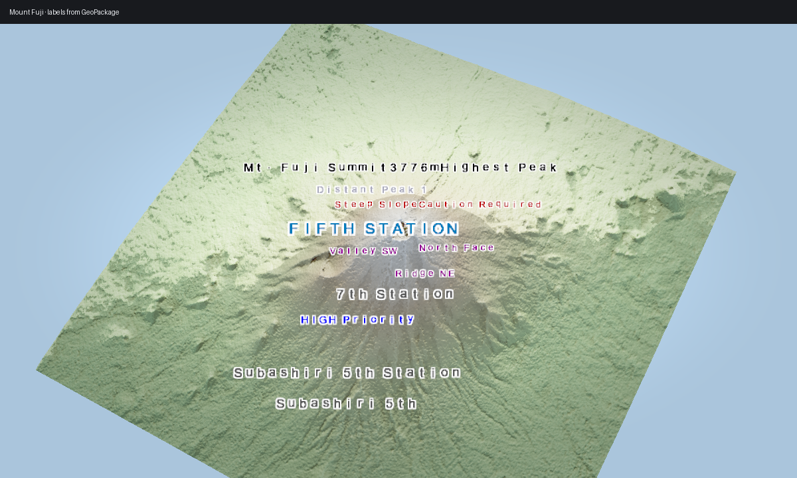

# Mount Fuji Labels



Mount Fuji is a good label scene because the terrain silhouette is simple and
the associated placename dataset is small.

## Ingredients

- `forge3d.fetch_dem("fuji")`
- `forge3d.fetch_dataset("mount-fuji-places")`
- `ViewerHandle.send_ipc()`

## Sketch

```python
import forge3d as f3d

with f3d.open_viewer_async(terrain_path=f3d.fetch_dem("fuji")) as viewer:
    viewer.set_orbit_camera(phi_deg=18, theta_deg=54, radius=6400)
    viewer.send_ipc(
        {
            "cmd": "add_label",
            "text": "Mount Fuji",
            "world_pos": [0.0, 0.0, 0.0],
            "size": 18,
            "halo_width": 2.0,
        }
    )
    viewer.snapshot("fuji-labels.png")
```
