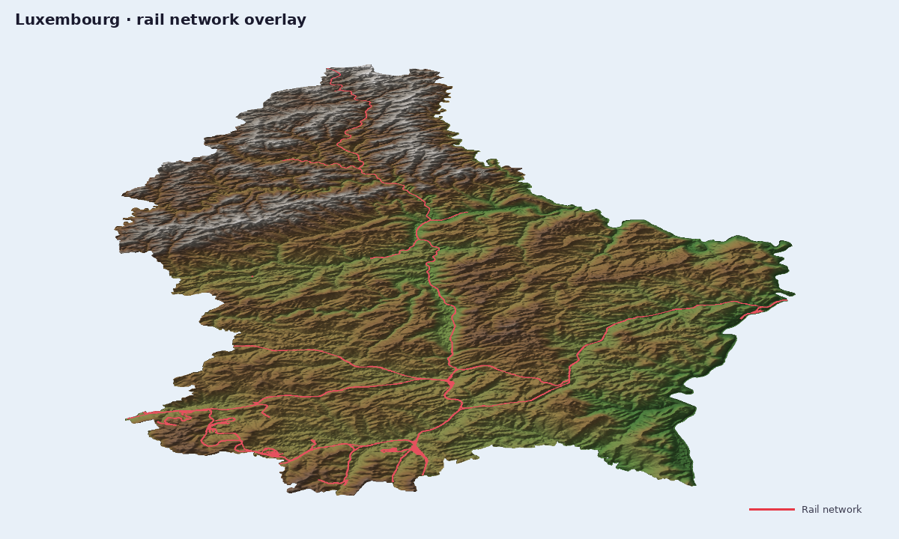

# Luxembourg Rail Network



Luxembourg is a compact example for terrain plus transport overlays.

## Ingredients

- `forge3d.fetch_dem("luxembourg")`
- `forge3d.fetch_dataset("luxembourg-rail")`
- `forge3d.viewer_ipc.add_vector_overlay()`

## Sketch

```python
import forge3d as f3d

with f3d.open_viewer_async(terrain_path=f3d.fetch_dem("luxembourg")) as viewer:
    viewer.send_ipc(
        {
            "cmd": "add_vector_overlay",
            "name": "rail",
            "vertices": [
                [0.0, 0.0, 0.0, 0.87, 0.1, 0.1, 1.0],
                [25.0, 12.0, 0.0, 0.87, 0.1, 0.1, 1.0],
                [60.0, 30.0, 0.0, 0.87, 0.1, 0.1, 1.0],
            ],
            "indices": [0, 1, 1, 2],
            "primitive": "lines",
            "drape": True,
            "line_width": 3.0,
        }
    )
    viewer.snapshot("luxembourg-rail.png")
```
