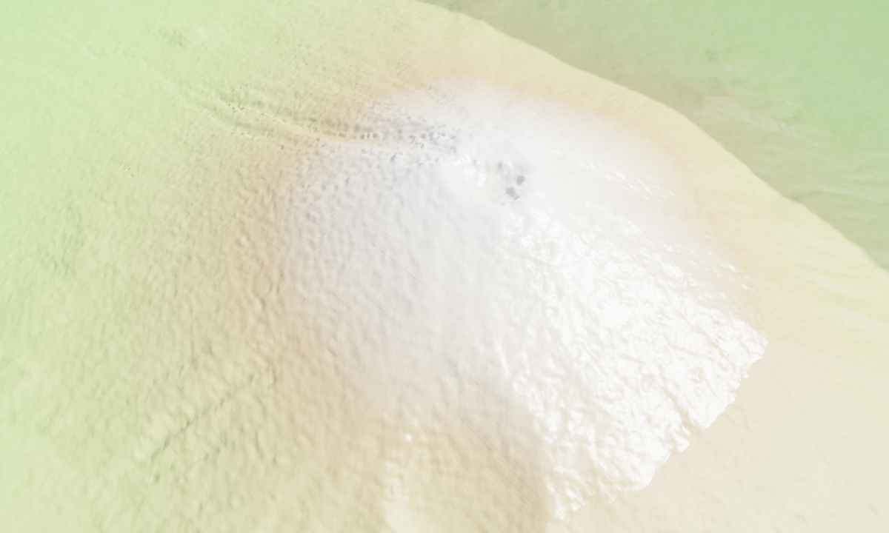

# 3D Buildings

> **Pro Feature:** The buildings import pipeline in this recipe requires a
> [Pro license](https://forge3d.dev/pro).



The buildings pipeline is split between parsing and rendering. The parser is
stable on the Python side; pushing triangles into the viewer depends on native
geometry extraction being available.

## Ingredients

- `forge3d.add_buildings_cityjson()`
- `forge3d.material_from_name()`
- `ViewerHandle.send_ipc()`

## Sketch

```python
import forge3d as f3d

layer = f3d.add_buildings_cityjson(f3d.fetch_cityjson("sample-buildings"))
print(layer.building_count, layer.total_vertices)
```

If `layer.total_vertices > 0`, forward the extracted triangles to
`add_vector_overlay` as shown in the GIS tutorial.
