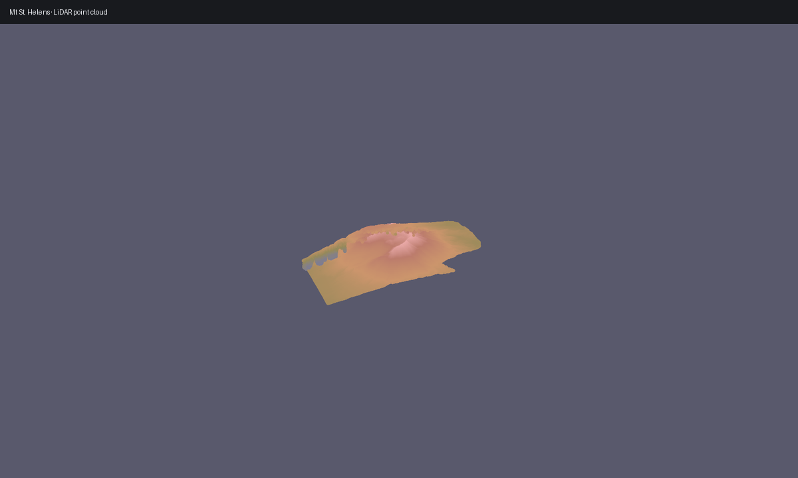

# Point Cloud



This entry keeps the terrain optional and focuses on the LAZ workflow.

## Ingredients

- `forge3d.fetch_copc("mt-st-helens")`
- `ViewerHandle.load_point_cloud()`
- `ViewerHandle.set_point_cloud_params()`

## Sketch

```python
import forge3d as f3d

with f3d.open_viewer_async() as viewer:
    viewer.load_point_cloud(f3d.fetch_copc("mt-st-helens"), point_size=1.5, max_points=250_000)
    viewer.set_point_cloud_params(point_size=2.0, color_mode="rgb")
    viewer.snapshot("point-cloud.png")
```
