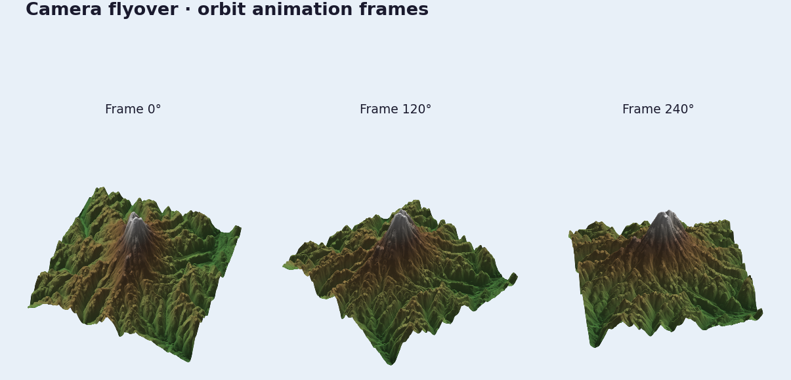

# Camera Flyover



The viewer handle is scriptable enough that a flyover can still be just a frame
loop, but TV17 also adds reusable terrain rig authoring that bakes straight into
`CameraAnimation`.

## Ingredients

- `forge3d.open_viewer_async()`
- `ViewerHandle.set_orbit_camera()`
- `ViewerHandle.snapshot()`
- `forge3d.camera_rigs`

## Low-Level Baseline

```python
import forge3d as f3d

with f3d.open_viewer_async(terrain_path=f3d.fetch_dem("rainier")) as viewer:
    for step, phi in enumerate(range(0, 360, 20)):
        viewer.set_orbit_camera(phi_deg=phi, theta_deg=50, radius=5400)
        viewer.snapshot(f"frames/frame-{step:03d}.png")
```

## Rig Demo

For reusable orbit, rail, and follow shots, use
`examples/terrain_camera_rigs_demo.py`. It bakes the rig to the same
`CameraAnimation` object used by the low-level loop above:

```python
import forge3d as f3d
from forge3d.camera_rigs import TerrainOrbitRig, TerrainClearance
from forge3d.terrain_scatter import TerrainScatterSource

source = TerrainScatterSource(f3d.mini_dem(), terrain_width=256.0)
rig = TerrainOrbitRig(
    target_xz=(128.0, 128.0),
    duration=6.0,
    radius=60.0,
    phi_start_deg=20.0,
    phi_end_deg=320.0,
    clearance=TerrainClearance(minimum_height=4.0),
)
animation = rig.bake(source, samples_per_second=60)
```

The demo ships three preset shots:

- `orbit_rainier`
- `rail_luxembourg`
- `follow_rainier`

Example:

```bash
python examples/terrain_camera_rigs_demo.py --preset rail_luxembourg
```
