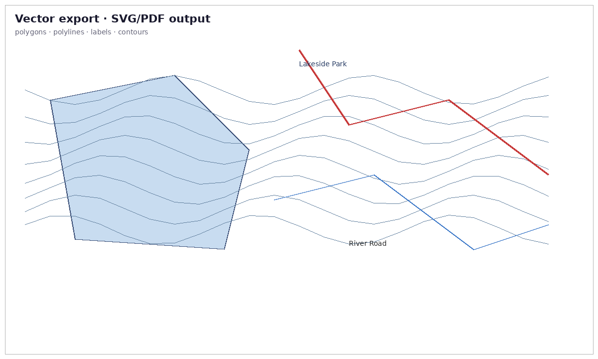

# Vector Export

> **Pro Feature:** SVG and PDF export require a
> [Pro license](https://forge3d.dev/pro).



Not every final output needs to stay in the raster viewer. `forge3d.export`
covers clean 2D vector deliverables.

## Ingredients

- `forge3d.VectorScene`
- `forge3d.export_svg()`
- `forge3d.export_pdf()`

## Sketch

```python
import forge3d as f3d

scene = f3d.VectorScene()
scene.add_polygon([(0, 0), (100, 0), (80, 70), (10, 90)], fill_color=(0.2, 0.5, 0.85, 0.9))
scene.add_polyline([(5, 10), (40, 35), (90, 60)], stroke_color=(0.1, 0.1, 0.1, 1.0), stroke_width=2.5)
scene.add_label("Ridge", position=(55, 52))
f3d.export_svg(scene, "overlay.svg", width=1200, height=800)
```
