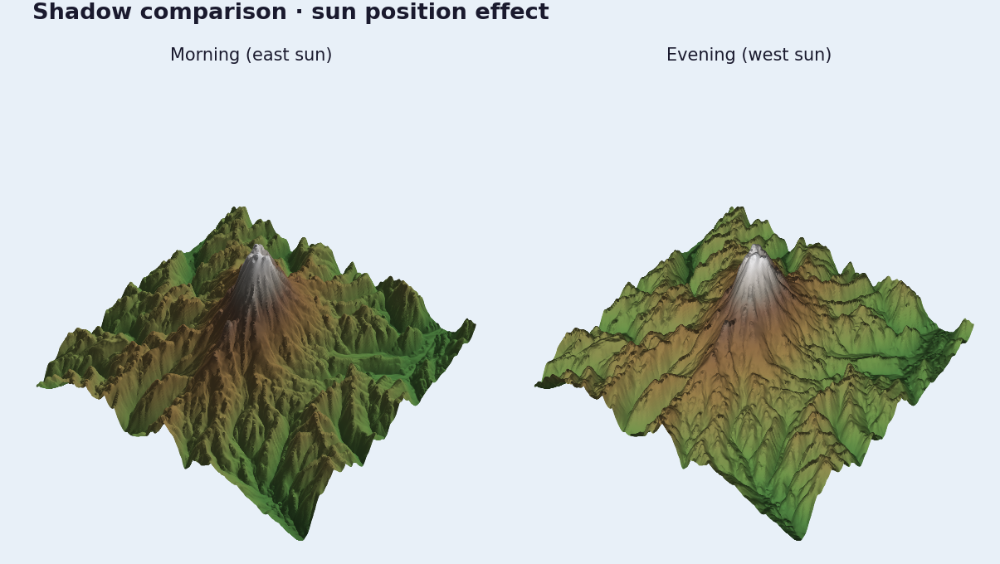

# Shadow Comparison



The quickest comparison workflow is two snapshots with different lighting.

## Ingredients

- `forge3d.open_viewer_async()`
- `ViewerHandle.set_sun()`
- `ViewerHandle.snapshot()`

## Sketch

```python
import forge3d as f3d

with f3d.open_viewer_async(terrain_path=f3d.fetch_dem("rainier")) as viewer:
    viewer.set_sun(azimuth_deg=110, elevation_deg=18)
    viewer.snapshot("rainier-morning.png")
    viewer.set_sun(azimuth_deg=285, elevation_deg=42)
    viewer.snapshot("rainier-evening.png")
```
