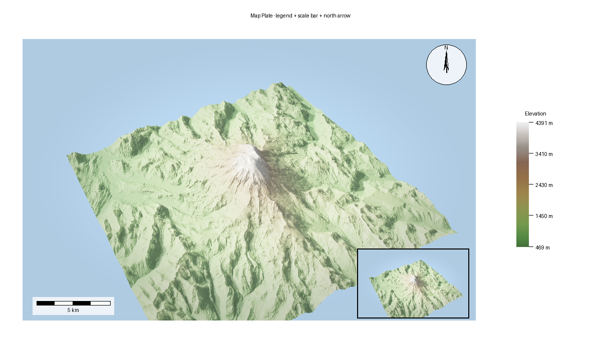

# Map Plate

> **Pro Feature:** Map plate composition requires a
> [Pro license](https://forge3d.dev/pro).



This is the production-output side of the platform: start from a rendered image,
then add cartographic furniture and export a finished layout.

## Ingredients

- `forge3d.open_viewer_async`
- `forge3d.MapPlate`
- `forge3d.Legend`
- `forge3d.ScaleBar`
- `forge3d.NorthArrow`

## Sketch

```python
from pathlib import Path

import numpy as np
from PIL import Image

import forge3d as f3d

source_path = Path("plate-source.png")

with f3d.open_viewer_async(terrain_path=f3d.mini_dem_path(), width=1200, height=760) as viewer:
    viewer.set_orbit_camera(phi_deg=32, theta_deg=56, radius=1.7, fov_deg=45)
    viewer.set_sun(azimuth_deg=315, elevation_deg=32)
    viewer.snapshot(source_path, width=1200, height=760)

rgba = np.asarray(Image.open(source_path).convert("RGBA"), dtype=np.uint8)

plate = f3d.MapPlate()
plate.set_map_region(rgba, f3d.BBox(west=-122.0, south=46.7, east=-121.6, north=46.95))
plate.add_title("Mini DEM Plate")
plate.export_png("map-plate.png")
```
