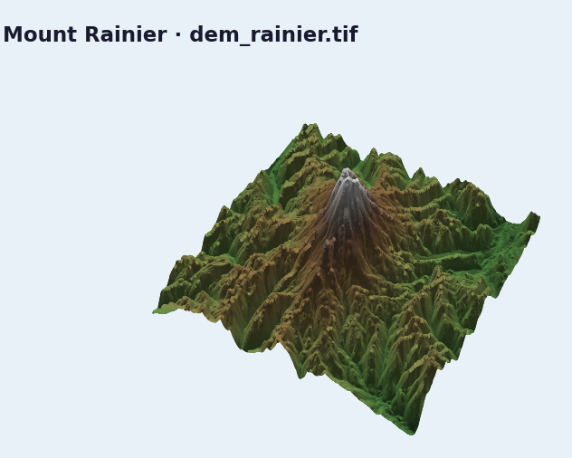

# Visualize Your First DEM

Start with a real GeoTIFF-backed terrain scene and keep the control loop small:
open viewer, set camera, set sun, snapshot.

## Load a DEM

```python
import forge3d as f3d

dem_path = f3d.fetch_dem("rainier")

with f3d.open_viewer_async(
    terrain_path=dem_path,
    width=1440,
    height=900,
) as viewer:
    viewer.set_orbit_camera(phi_deg=25, theta_deg=50, radius=5200, fov_deg=42)
    viewer.set_sun(azimuth_deg=300, elevation_deg=26)
    viewer.snapshot("rainier-first-look.png", width=1800, height=1125)
```

## Fast local fallback

If you want a tiny offline sample first, swap in the bundled DEM:

```python
mini = f3d.mini_dem_path()
with f3d.open_viewer_async(terrain_path=mini) as viewer:
    viewer.snapshot("mini-dem.png")
```

## What matters

- `fetch_dem()` keeps examples stable across local checkouts and clean installs.
- `open_viewer_async()` gives you an immediately scriptable scene.
- Camera and lighting are normal Python calls, not shell flags or manual UI
  steps.

Next: [](02-drape-overlays-on-terrain.md)

## Expected output


