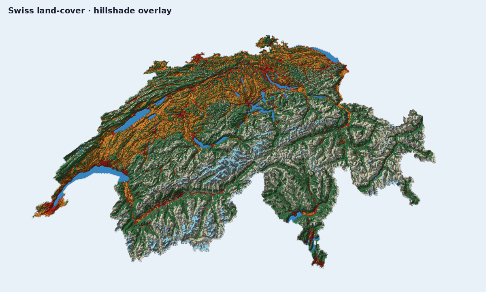

# Drape Overlays On Terrain

Raster overlays stay in the main viewer path: load terrain, add a named layer,
then adjust opacity and draw order. The polished Swiss scene below is the same
one rendered by `scripts/regenerate_gallery.py`.

## Example: Swiss DEM plus land-cover overlay

```python
import forge3d as f3d

dem_path = f3d.fetch_dem("swiss")
overlay_path = f3d.fetch_dataset("swiss-land-cover")

with f3d.open_viewer_async(terrain_path=dem_path, width=1500, height=960) as viewer:
    viewer.load_overlay(
        name="land-cover",
        path=overlay_path,
        opacity=0.82,
        z_order=10,
    )
    viewer.set_orbit_camera(phi_deg=42, theta_deg=58, radius=9000)
    viewer.set_sun(azimuth_deg=312, elevation_deg=33)
    viewer.snapshot("swiss-land-cover.png")
```

## Gallery-backed script

The gallery image for this workflow comes from
`examples/swiss_terrain_landcover_viewer.py`, invoked by
`scripts/regenerate_gallery.py` with a higher-quality preset:

```bash
python examples/swiss_terrain_landcover_viewer.py ^
  --preset hq4 ^
  --width 3840 --height 3840 ^
  --cam-radius 14000 ^
  --cam-phi 80 ^
  --no-solid ^
  --background "#ffffff" ^
  --legend-position northwest ^
  --legend-scale 0.3 ^
  --legend-transparent-bg ^
  --msaa 8 ^
  --shadow-technique pcss ^
  --exposure 1.35 ^
  --snapshot swiss-land-cover.png
```

## When you need vector overlays

The high-level viewer wrapper currently exposes raster drape loading directly.
For custom vector geometry, drop to raw IPC:

```python
viewer.send_ipc(
    {
        "cmd": "add_vector_overlay",
        "name": "ridge-line",
        "vertices": [
            [0.0, 0.0, 0.0, 0.95, 0.3, 0.2, 1.0],
            [50.0, 20.0, 0.0, 0.95, 0.3, 0.2, 1.0],
            [90.0, 35.0, 0.0, 0.95, 0.3, 0.2, 1.0],
        ],
        "indices": [0, 1, 1, 2],
        "primitive": "lines",
        "drape": True,
        "line_width": 3.0,
    }
)
```

That is the same IPC surface the lower-level helpers in `forge3d.viewer_ipc`
wrap for scripts. If you want the exact published render, follow the gallery
script above or start from [](../../gallery/03-swiss-landcover.md).

Next: [](03-build-a-map-plate.md)

## Expected output


