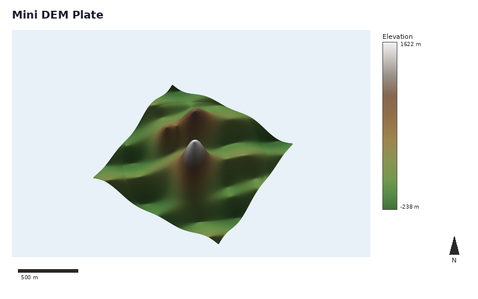

# Build A Map Plate

> **Pro Feature:** This tutorial uses features that require a
> commercial license. See https://github.com/milos-agathon/forge3d#license. You can read and learn from the code,
> but the highlighted functions will raise `LicenseError` without a valid key.

`MapPlate` is the composition layer above the live viewer. It takes an RGBA map
image and adds cartographic furniture such as a title, legend, scale bar, north
arrow, and insets.

This example keeps the source image on the main viewer path by taking a
snapshot first, then composing the plate from that RGBA output.

## Compose a plate

```python
from pathlib import Path

import numpy as np
from PIL import Image

import forge3d as f3d

dem = f3d.mini_dem()
snapshot_path = Path("mini-dem-source.png")

with f3d.open_viewer_async(
    terrain_path=f3d.mini_dem_path(),
    width=1200,
    height=760,
) as viewer:
    viewer.set_orbit_camera(phi_deg=32, theta_deg=56, radius=1.7, fov_deg=45)
    viewer.set_sun(azimuth_deg=315, elevation_deg=32)
    viewer.snapshot(snapshot_path, width=1200, height=760)

map_rgba = np.asarray(Image.open(snapshot_path).convert("RGBA"), dtype=np.uint8)

bbox = f3d.BBox(west=-122.0, south=46.7, east=-121.6, north=46.95)
domain = (float(dem.min()), float(dem.max()))

legend = f3d.Legend.from_colormap(
    f3d.get_colormap("terrain"),
    domain=domain,
    config=f3d.LegendConfig(title="Elevation", label_suffix=" m"),
)

meters_per_pixel = f3d.ScaleBar.compute_meters_per_pixel(bbox, image_width=map_rgba.shape[1])
scale_bar = f3d.ScaleBar(meters_per_pixel, config=f3d.ScaleBarConfig(units="km"))
north_arrow = f3d.NorthArrow(f3d.NorthArrowConfig(style="compass", size=72))

plate = f3d.MapPlate(f3d.MapPlateConfig(width=1600, height=1000))
plate.set_map_region(map_rgba, bbox)
plate.add_title("Mini DEM Plate", font_size=28)
plate.add_legend(legend.render())
plate.add_scale_bar(scale_bar.render())
plate.add_north_arrow(north_arrow.render())
plate.export_png("mini-dem-plate.png")
```

## Notes

- `MapPlate` works with any RGBA image, including viewer snapshots.
- `Legend`, `ScaleBar`, and `NorthArrow` are separate renderers so you can
  customize them independently.
- For real-world products, use the actual map bounds and image width when
  computing `meters_per_pixel`.

Next: [](04-3d-buildings.md)

## Expected output


