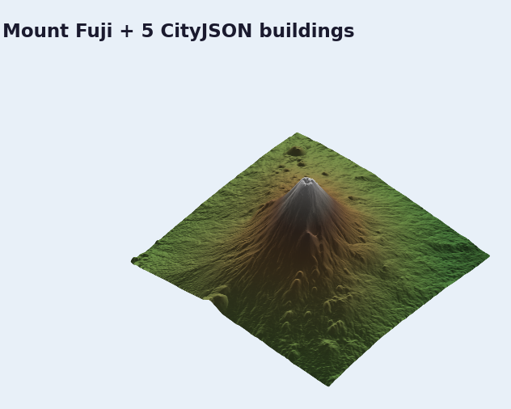

# 3D Buildings

> **Pro Feature:** This tutorial uses features that require a
> [Pro license](https://forge3d.dev/pro). You can read and learn from the code,
> but the highlighted functions will raise `LicenseError` without a valid key.

The buildings module sits between GIS assets and the viewer. It parses common
building sources, exposes materials and metadata, and can forward extracted
triangles to the viewer when native geometry extraction is available.

## Load a CityJSON sample

```python
import forge3d as f3d

cityjson_path = f3d.fetch_cityjson("sample-buildings")
layer = f3d.add_buildings_cityjson(cityjson_path)

print(layer.building_count)
print(layer.total_vertices)
print(layer.bounds())
```

## Inspect material defaults

```python
brick = f3d.material_from_name("brick")
glass = f3d.material_from_name("glass")
print(brick)
print(glass)
```

## Push native geometry to the viewer

If the native building parser produced triangles, you can send them through the
viewer's vector overlay IPC path.

```python
import forge3d as f3d

layer = f3d.add_buildings_cityjson(f3d.fetch_cityjson("sample-buildings"))
building = layer.buildings[0]

if building.positions.size == 0:
    raise RuntimeError(
        "This environment only has the metadata fallback. "
        "Build/install the native extension for extracted building geometry."
    )

positions = building.positions.reshape(-1, 3)
r, g, b = building.material.albedo
vertices = [
    [float(x), float(y), float(z), float(r), float(g), float(b), 1.0]
    for x, y, z in positions
]

with f3d.open_viewer_async(terrain_path=f3d.fetch_dem("fuji")) as viewer:
    viewer.send_ipc(
        {
            "cmd": "add_vector_overlay",
            "name": building.id,
            "vertices": vertices,
            "indices": building.indices.astype(int).tolist(),
            "primitive": "triangles",
            "drape": False,
            "opacity": 1.0,
        }
    )
    viewer.snapshot("buildings-overlay.png")
```

That is the current Phase 2 bridge between parsed buildings and the live viewer.

## Expected output


