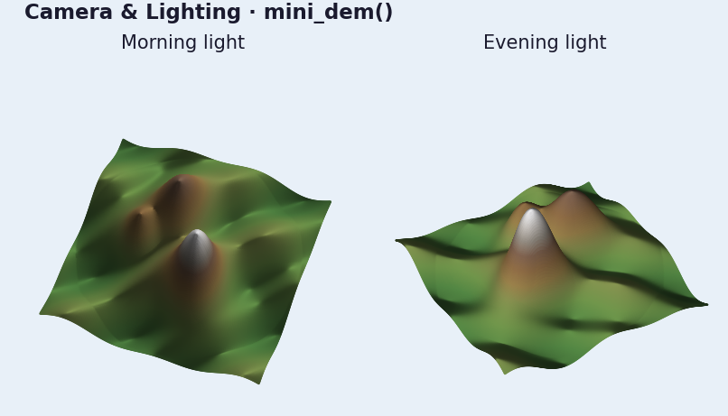

# Camera, Lighting, And Animation

Camera and lighting control are ordinary method calls on `ViewerHandle`, which
makes automation straightforward.

## Manual camera and sun updates

```python
import forge3d as f3d

with f3d.open_viewer_async(terrain_path=f3d.mini_dem_path()) as viewer:
    viewer.set_orbit_camera(phi_deg=20, theta_deg=60, radius=1.5, fov_deg=40)
    viewer.set_sun(azimuth_deg=250, elevation_deg=38)
    viewer.snapshot("frame-000.png")
```

## Simple scripted flyover

```python
from pathlib import Path

import forge3d as f3d

frames = Path("frames")
frames.mkdir(exist_ok=True)

with f3d.open_viewer_async(terrain_path=f3d.mini_dem_path()) as viewer:
    for step, phi in enumerate(range(0, 360, 30)):
        viewer.set_orbit_camera(phi_deg=phi, theta_deg=52, radius=1.8, fov_deg=45)
        viewer.set_sun(azimuth_deg=315 - phi * 0.25, elevation_deg=30)
        viewer.snapshot(frames / f"frame-{step:03d}.png", width=1280, height=720)
```

## Notebook widget version

```python
widget = f3d.ViewerWidget(
    terrain_path=f3d.mini_dem_path(),
    src=f3d.mini_dem_path(),
    width=960,
    height=600,
)
widget.set_camera(phi_deg=48, theta_deg=50, radius=1.6)
widget.set_sun(azimuth_deg=290, elevation_deg=34)
widget
```

Next: [](03-point-clouds.md)

## Expected output


