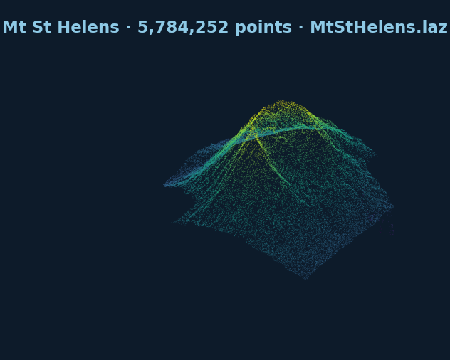

# Point Clouds

Point clouds stay on the same viewer IPC surface as terrain and overlays.

## Load a LAZ sample

```python
import forge3d as f3d

cloud_path = f3d.fetch_copc("mt-st-helens")

with f3d.open_viewer_async(width=1440, height=900) as viewer:
    viewer.load_point_cloud(
        cloud_path,
        point_size=1.5,
        max_points=250_000,
        color_mode="rgb",
    )
    viewer.set_point_cloud_params(point_size=2.0, visible=True)
    viewer.snapshot("mt-st-helens-cloud.png")
```

## Blend terrain and point cloud

```python
with f3d.open_viewer_async(terrain_path=f3d.fetch_dem("rainier")) as viewer:
    viewer.load_point_cloud(f3d.fetch_copc("mt-st-helens"), max_points=150_000)
    viewer.set_orbit_camera(phi_deg=24, theta_deg=48, radius=6200)
    viewer.snapshot("terrain-plus-cloud.png")
```

The point-cloud helper is thin by design. If you need advanced tuning beyond the
convenience methods, use `viewer.send_ipc(...)` directly.

Next: [](04-scene-bundles.md)

## Expected output


