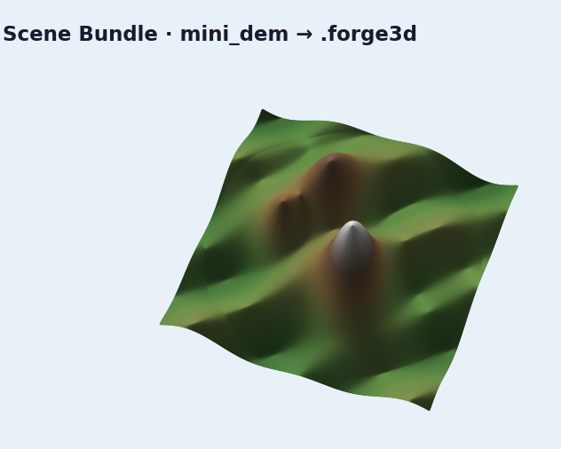

# Scene Bundles

Bundles package terrain, overlays, presets, and bookmarks into a portable
directory with checksums.

## Save a bundle

```python
import forge3d as f3d

bookmarks = [
    f3d.CameraBookmark(
        name="overview",
        eye=(0.0, 2.0, 3.0),
        target=(0.0, 0.0, 0.0),
        fov_deg=42.0,
    )
]

bundle_path = f3d.save_bundle(
    "mini-scene.forge3d",
    name="Mini Scene",
    dem_path=f3d.mini_dem_path(),
    colormap_name="terrain",
    domain=(float(f3d.mini_dem().min()), float(f3d.mini_dem().max())),
    camera_bookmarks=bookmarks,
    preset={"sun": {"azimuth_deg": 315, "elevation_deg": 30}},
)
print(bundle_path)
```

## Load and inspect

```python
loaded = f3d.load_bundle(bundle_path)
print(loaded.dem_path)
print(loaded.manifest.camera_bookmarks[0].name)
print(loaded.preset)
```

## Load the same bundle into a running viewer

`ViewerHandle` does not have a dedicated bundle helper yet, so use raw IPC:

```python
with f3d.open_viewer_async() as viewer:
    viewer.send_ipc({"cmd": "LoadBundle", "path": str(bundle_path)})
    viewer.snapshot("bundle-loaded.png")
```

## Expected output


