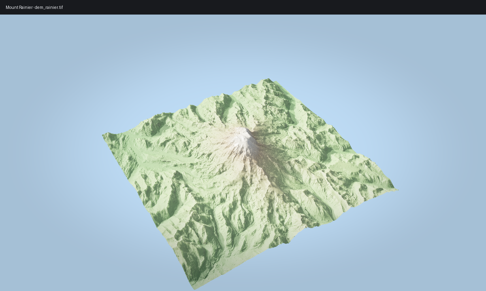

# Scene Bundles

> **Pro Feature:** This tutorial uses features that require a
> commercial license. See https://github.com/milos-agathon/forge3d#license. You can read and learn from the code,
> but the highlighted functions will raise `LicenseError` without a valid key.

Bundles package terrain, overlays, presets, and bookmarks into a portable
directory with checksums.

## Save a bundle

```python
import forge3d as f3d

bookmarks = [
    f3d.CameraBookmark(
        name="overview",
        eye=(0.0, 2.0, 3.0),
        target=(0.0, 0.0, 0.0),
        fov_deg=42.0,
    )
]

bundle_path = f3d.save_bundle(
    "mini-scene.forge3d",
    name="Mini Scene",
    dem_path=f3d.mini_dem_path(),
    colormap_name="terrain",
    domain=(float(f3d.mini_dem().min()), float(f3d.mini_dem().max())),
    camera_bookmarks=bookmarks,
    preset={"sun": {"azimuth_deg": 315, "elevation_deg": 30}},
)
print(bundle_path)
```

## Load and inspect

```python
loaded = f3d.load_bundle(bundle_path)
print(loaded.dem_path)
print(loaded.manifest.camera_bookmarks[0].name)
print(loaded.preset)
```

## Load the same bundle into a running viewer

`ViewerHandle` does not have a dedicated high-level bundle loader yet. Load the
bundle in Python, then apply its terrain, bookmark, and preset state to the
viewer explicitly:

```python
loaded = f3d.load_bundle(bundle_path)
bookmark = loaded.manifest.camera_bookmarks[0]
sun = (loaded.preset or {}).get("sun", {})

with f3d.open_viewer_async(terrain_path=loaded.dem_path) as viewer:
    viewer.set_camera_lookat(
        eye=bookmark.eye,
        target=bookmark.target,
        up=bookmark.up,
    )
    viewer.set_fov(bookmark.fov_deg)
    if sun:
        viewer.set_sun(
            azimuth_deg=float(sun.get("azimuth_deg", 315.0)),
            elevation_deg=float(sun.get("elevation_deg", 30.0)),
        )
    viewer.snapshot("bundle-loaded.png")
```

That flow is what actually works today. Raw `LoadBundle` IPC only queues a
pending request for higher-level interactive apps to handle.

## Expected output


